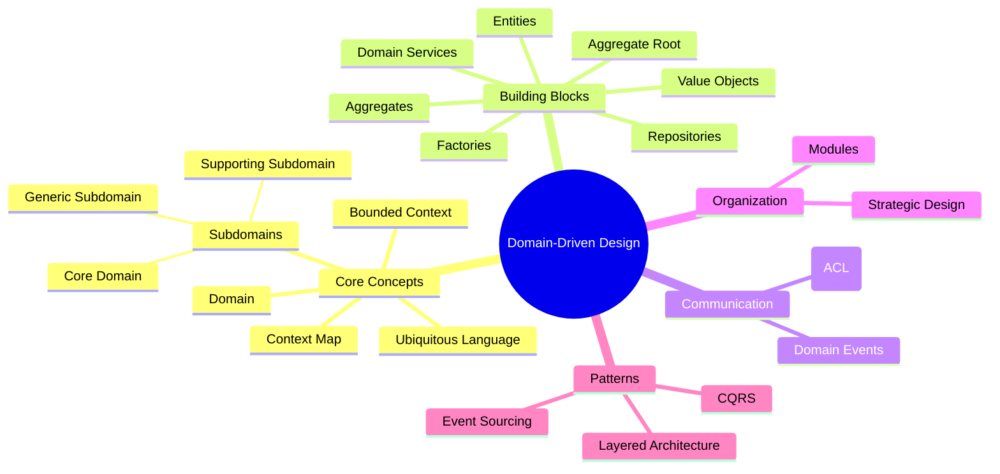

# Domain-Driven Design (DDD)

# Table of Contents

1. [Domain](#1-domain)
2. [Ubiquitous Language](#2-ubiquitous-language)
3. [Bounded Context](#3-bounded-context)
4. [Entities](#4-entities)
5. [Value Objects](#5-value-objects)
6. [Aggregates](#6-aggregates)
7. [Aggregate Root](#7-aggregate-root)
8. [Repositories](#8-repositories)
9. [Factories](#9-factories)
10. [Services (Domain Services)](#10-services-domain-services)
11. [Modules](#11-modules)
12. [Domain Events](#12-domain-events)
13. [Anti-Corruption Layer (ACL)](#13-anti-corruption-layer-acl)
14. [Context Map](#14-context-map)
15. [Subdomains](#15-subdomains)
    - [Core Domain](#core-domain)
    - [Supporting Subdomain](#supporting-subdomain)
    - [Generic Subdomain](#generic-subdomain)
16. [Strategic Design](#16-strategic-design)
    - [Big Picture](#big-picture)
    - [Techniques](#techniques)

---

## 1. Domain
| **Aspect**    | **Details**                                                             |
|---------------|--------------------------------------------------------------------------|
| **Definition**| The core business problem or area that the software system is intended to solve. |
| **Example**   | If you are building software for an e-commerce platform, the domain could be "Online Retail" focusing on buying, selling, and managing products. |
| **Purpose**   | Focuses development efforts on the actual business needs and logic.      |

## 2. Ubiquitous Language
| **Aspect**    | **Details**                                                             |
|---------------|--------------------------------------------------------------------------|
| **Definition**| A shared language created by the development team and domain experts, used by everyone in the project. |
| **Example**   | In the "Online Retail" domain, terms like "Shopping Cart," "Checkout," "Order," and "Customer" are used consistently by both developers and business stakeholders. |
| **Purpose**   | Ensures clear communication and understanding, eliminating ambiguities.  |

## 3. Bounded Context
| **Aspect**    | **Details**                                                             |
|---------------|--------------------------------------------------------------------------|
| **Definition**| A specific boundary within which a particular model is defined and applicable. |
| **Example**   | In an e-commerce system, the "Product Catalog" bounded context might include models like `Product`, `Category`, and `Inventory`. This context is separate from the "Order Management" context, which might include `Order`, `Payment`, and `Shipment`. |
| **Purpose**   | Clarifies the scope of a model, reducing confusion and conflicts between different parts of the system. |

## 4. Entities
| **Aspect**    | **Details**                                                             |
|---------------|--------------------------------------------------------------------------|
| **Definition**| Objects that have a distinct identity that runs through time and different states. |
| **Example**   | A `Customer` with a unique ID that persists across transactions.         |
| **Purpose**   | Tracks meaningful changes and lifecycle within the domain.               |

## 5. Value Objects
| **Aspect**    | **Details**                                                             |
|---------------|--------------------------------------------------------------------------|
| **Definition**| Objects that are defined by their attributes rather than a unique identity. |
| **Example**   | A `Money` object defined by amount and currency.                         |
| **Purpose**   | Models concepts that are immutable and interchangeable.                 |

## 6. Aggregates
| **Aspect**    | **Details**                                                             |
|---------------|--------------------------------------------------------------------------|
| **Definition**| A cluster of domain objects that can be treated as a single unit. An aggregate has a root entity (Aggregate Root). |
| **Example**   | An `Order` aggregate containing `Order Items`.                           |
| **Purpose**   | Enforces consistency within a boundary and controls access to the objects within. |

## 7. Aggregate Root
| **Aspect**    | **Details**                                                             |
|---------------|--------------------------------------------------------------------------|
| **Definition**| The single entry point for interacting with an aggregate.                |
| **Example**   | `Order` as the aggregate root for an `Order` aggregate.                  |
| **Purpose**   | Ensures the integrity and consistency of the aggregate.                 |

## 8. Repositories
| **Aspect**    | **Details**                                                             |
|---------------|--------------------------------------------------------------------------|
| **Definition**| Mechanisms for accessing aggregates, typically through CRUD operations.  |
| **Example**   | `CustomerRepository` that retrieves `Customer` entities.                |
| **Purpose**   | Abstracts the persistence layer, enabling domain logic to remain independent of data storage concerns. |

## 9. Factories
| **Aspect**    | **Details**                                                             |
|---------------|--------------------------------------------------------------------------|
| **Definition**| Objects or methods responsible for creating instances of entities or aggregates. |
| **Example**   | An `OrderFactory` to create complex `Order` aggregates.                  |
| **Purpose**   | Encapsulates the creation logic, ensuring that the invariants of the domain model are respected. |

## 10. Services (Domain Services)
| **Aspect**    | **Details**                                                             |
|---------------|--------------------------------------------------------------------------|
| **Definition**| Operations that don’t naturally fit within an entity or value object.    |
| **Example**   | A `PricingService` that calculates discounts.                            |
| **Purpose**   | Handles domain logic that spans multiple entities or doesn’t belong to any specific entity. |

## 11. Modules
| **Aspect**    | **Details**                                                             |
|---------------|--------------------------------------------------------------------------|
| **Definition**| Logical groups of related concepts within the domain.                   |
| **Example**   | A `Billing` module containing entities like `Invoice`, `Payment`, and `Receipt`. |
| **Purpose**   | Organizes the domain model for better manageability and understanding.  |

## 12. Domain Events
| **Aspect**    | **Details**                                                             |
|---------------|--------------------------------------------------------------------------|
| **Definition**| A representation of something important that happened within the domain. |
| **Example**   | `OrderPlaced` event when a new order is created.                         |
| **Purpose**   | Captures and communicates significant changes within the domain.        |

## 13. Anti-Corruption Layer (ACL)
| **Aspect**    | **Details**                                                             |
|---------------|--------------------------------------------------------------------------|
| **Definition**| A layer that translates between two different models or systems to prevent unwanted influence from an external system. |
| **Example**   | When integrating an older legacy system with a new e-commerce system, the ACL translates legacy `Product` data into the new system’s `ProductCatalog` model to ensure the legacy system doesn’t negatively impact the new design. |
| **Purpose**   | Protects the integrity of your domain by isolating it from external models. |

## 14. Context Map
| **Aspect**    | **Details**                                                             |
|---------------|--------------------------------------------------------------------------|
| **Definition**| A diagram or representation that shows how different bounded contexts relate to each other. |
| **Example**   | In a large enterprise system, the Context Map might show the relationships between the "Product Catalog," "Order Management," and "Billing" bounded contexts, indicating which contexts share data and how they communicate. |
| **Purpose**   | Visualizes the relationships and interactions between various bounded contexts within a system. |

## 15. Subdomains
| **Type**                | **Description**                                                                             |
|-------------------------|---------------------------------------------------------------------------------------------|
| **Core Domain**         | The main focus of the business, providing the most competitive advantage.                   |
| **Supporting Subdomain**| Helps the core domain, but not the central focus.                                           |
| **Generic Subdomain**   | Contains general-purpose functions that can be reused across different domains.             |

## 16. Strategic Design
| **Aspect**    | **Details**                                                             |
|---------------|--------------------------------------------------------------------------|
| **Big Picture**| Focuses on aligning the system architecture and organization with business goals. |
| **Techniques** | Bounded Context, Context Mapping, Distillation of Core Domain.          |

---

### Common Patterns & Practices
| **Pattern/Practice**      | **Details**                                                             |
|---------------------------|--------------------------------------------------------------------------|
| **Layered Architecture**   | Separation of concerns through layers like Application, Domain, and Infrastructure. |
| **CQRS (Command Query Responsibility Segregation)** | Splits read and write operations into separate models. |
| **Event Sourcing**         | Storing the state as a sequence of events.                              |

---

**Remember:** DDD is more about collaboration and clear boundaries than technology choices. The goal is to build software that accurately reflects and supports the business needs.
