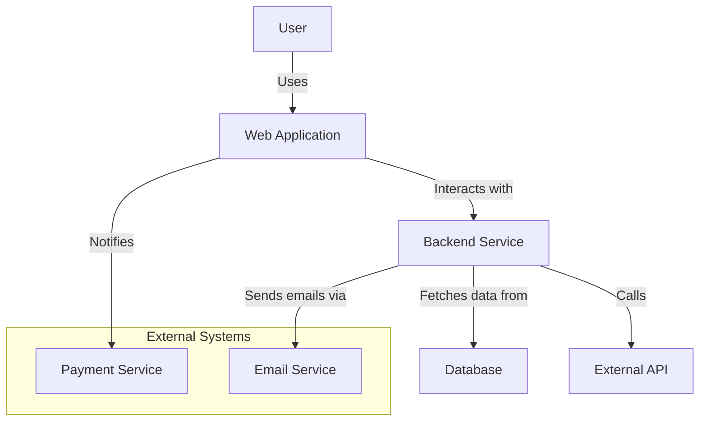
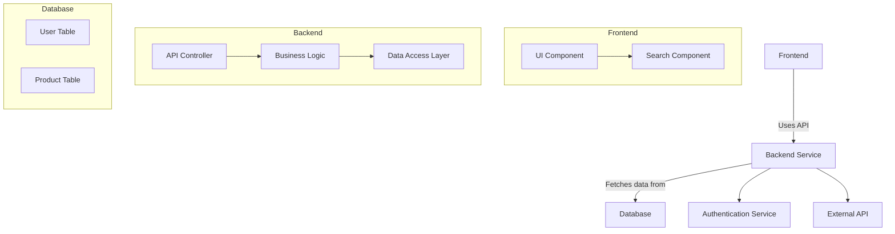
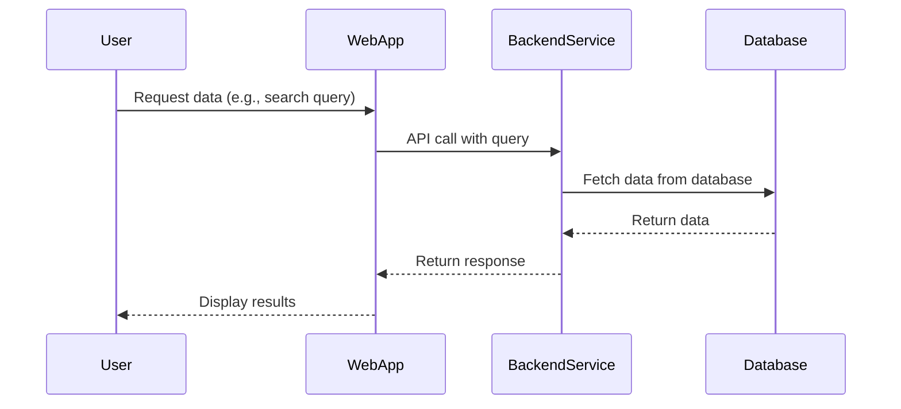
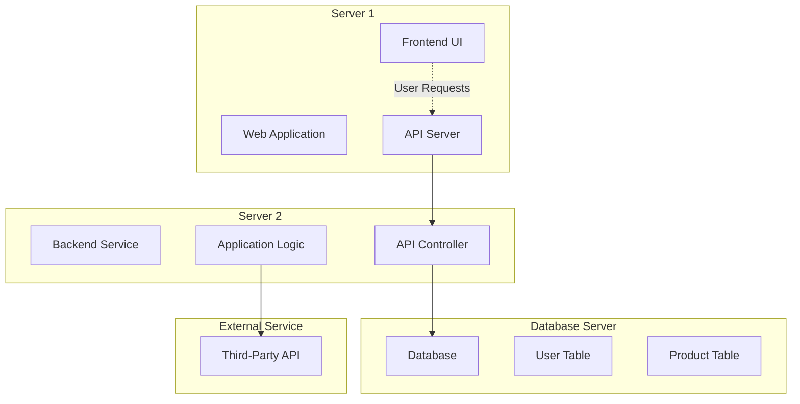

# Software Architecture Views

## Table of Contents
1. [Context View](#1-context-view)
2. [Building Blocks View](#2-building-blocks-view)
3. [Runtime View](#3-runtime-view)
4. [Deployment View](#4-deployment-view)
5. [Summary](#summary)

---

## 1. Context View
- **Purpose**: Shows the software system’s boundaries and interactions with its environment (external systems, users, or devices).
- **Focus**: High-level overview of external dependencies and interfaces.
- **Typical Stakeholders**: Project managers, product owners, and external system developers.
- **Key Questions Addressed**:
  - What lies within and outside the system?
  - Who or what interacts with the system, and how?

---

## 2. Building Blocks View
- **Purpose**: Illustrates the static structure of the system, including its components and their internal organization.
- **Focus**: Modular decomposition, showing how the system is divided into smaller parts (building blocks).
- **Typical Stakeholders**: Developers, architects, and maintainers.
- **Key Questions Addressed**:
  - What are the system's internal components?
  - How are they organized, and what are their responsibilities?
  - How do the components interact internally?

---

## 3. Runtime View
- **Purpose**: Describes the dynamic behavior of the system during execution.
- **Focus**: Interactions between components at runtime, including process communication, sequences, and data flow.
- **Typical Stakeholders**: Developers, testers, and operations teams.
- **Key Questions Addressed**:
  - How do components interact dynamically during execution?
  - What happens in specific use cases or scenarios?

---

## 4. Deployment View
- **Purpose**: Maps the software system to physical hardware infrastructure.
- **Focus**: Allocation of software components to physical nodes and their connections (e.g., servers, networks).
- **Typical Stakeholders**: DevOps, system administrators, and IT infrastructure teams.
- **Key Questions Addressed**:
  - Where does the software run?
  - How are hardware resources utilized?
  - How does the system ensure scalability, availability, and fault tolerance?

---

## Summary
These views are specifically designed to address the concerns of different stakeholders and provide a clear, practical way to understand the architecture of a software system. They are tailored for the CPSA-F curriculum and differ slightly from the classic **4+1 View Model** by focusing on stakeholder-specific needs.

### Links
- [iSAQB Official Website](https://www.isaqb.org/)
