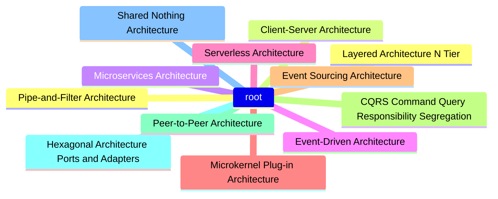

# Software Architecture Patterns

---

## Table of Contents

1. [Layered (N-Tier) Architecture](#1-layered-n-tier-architecture)
2. [Client-Server Architecture](#2-client-server-architecture)
3. [Microservices Architecture](#3-microservices-architecture)
4. [Event-Driven Architecture](#4-event-driven-architecture)
5. [Serverless Architecture](#5-serverless-architecture)
6. [Microkernel (Plug-in) Architecture](#6-microkernel-plug-in-architecture)
7. [Event Sourcing Architecture](#7-event-sourcing-architecture)
8. [CQRS (Command Query Responsibility Segregation)](#8-cqrs-command-query-responsibility-segregation)
9. [Peer-to-Peer Architecture](#9-peer-to-peer-architecture)
10. [Hexagonal Architecture (Ports and Adapters)](#10-hexagonal-architecture-ports-and-adapters)
11. [Shared Nothing Architecture](#11-shared-nothing-architecture)
12. [Pipe-and-Filter Architecture](#12-pipe-and-filter-architecture)
13. [Summary Table](#summary-table)

## 1. Layered (N-Tier) Architecture

- **Description**: Organizes the system into layers, each with a specific responsibility (e.g., presentation, business logic, data access).
- **Common Layers**:
    - **Presentation Layer** (UI)
    - **Business Logic Layer** (Domain)
    - **Data Access Layer** (Persistence)
    - **Database Layer** (Storage)
- **Use Case**: Enterprise applications, web apps where clear separation of concerns is necessary.
- **Pros**:
    - Separation of concerns
    - Easy to develop, test, and maintain
- **Cons**:
    - Performance overhead due to many layers
    - Can lead to tightly coupled layers if not properly managed

---

## 2. Client-Server Architecture

- **Description**: Separates the system into two parts: client (requesting resources) and server (providing resources).
- **Use Case**: Web applications, REST APIs, file-sharing systems.
- **Pros**:
    - Centralized control and security on the server
    - Scalability with multiple clients
- **Cons**:
    - Network latency and communication overhead
    - Server can become a bottleneck

---

## 3. Microservices Architecture

- **Description**: A collection of small, independently deployable services that communicate over a network. Each service is responsible for a specific business function.
- **Use Case**: Large-scale applications with complex domains (e.g., Netflix, Amazon).
- **Pros**:
    - High scalability and flexibility
    - Independent development and deployment
    - Fault isolation
- **Cons**:
    - Complex to manage and monitor
    - Requires skilled team and sophisticated infrastructure (e.g., service discovery, monitoring)

---

## 4. Event-Driven Architecture

- **Description**: Based on events triggering the execution of services or functions. The system reacts to events asynchronously.
- **Components**:
    - **Event Producers**: Generate events (e.g., user actions, system triggers)
    - **Event Consumers**: Process the events
- **Use Case**: Real-time systems (e.g., IoT, stock trading, user notification systems).
- **Pros**:
    - Highly scalable and loosely coupled
    - Reacts to changes in real-time
- **Cons**:
    - Complex event handling and monitoring
    - Debugging and testing can be difficult

---

## 5. Serverless Architecture

- **Description**: Applications run in stateless compute containers that are event-triggered and managed by cloud providers (e.g., AWS Lambda, Azure Functions).
- **Use Case**: Real-time file processing, dynamic websites, mobile backends.
- **Pros**:
    - No server management
    - Automatic scaling
    - Pay-as-you-go pricing model
- **Cons**:
    - Vendor lock-in
    - Limited control over infrastructure
    - Potential cold start latency

---

## 6. Microkernel (Plug-in) Architecture

- **Description**: Core system (microkernel) is minimal, with additional features or services added as plug-ins.
- **Use Case**: Product-based applications (e.g., IDEs like Eclipse, web browsers with plugins).
- **Pros**:
    - High extensibility and flexibility
    - Core remains lightweight and focused
- **Cons**:
    - Plugin management can get complicated
    - Testing becomes difficult with many plug-ins

---

## 7. Event Sourcing Architecture

- **Description**: Instead of storing the current state of data, it stores a sequence of events that describe all changes to the state.
- **Use Case**: Financial systems, audit logging, any system requiring a detailed history of changes.
- **Pros**:
    - Complete historical trace of changes
    - Easy to rebuild past states
- **Cons**:
    - Increased complexity in event management
    - Storage requirements are higher due to event log

---

## 8. CQRS (Command Query Responsibility Segregation)

- **Description**: Segregates read operations (queries) from write operations (commands), allowing each to be optimized independently.
- **Use Case**: Systems with high read/write performance demands (e.g., large e-commerce platforms).
- **Pros**:
    - Read and write models are optimized separately
    - Scalability for complex, high-traffic systems
- **Cons**:
    - Increased complexity in managing two models
    - Synchronization between read and write stores can be tricky

---

## 9. Peer-to-Peer Architecture

- **Description**: Every node in the network acts as both a client and a server, allowing direct sharing of resources.
- **Use Case**: File sharing (e.g., BitTorrent), blockchain, decentralized applications.
- **Pros**:
    - High fault tolerance (no single point of failure)
    - Efficient use of resources
- **Cons**:
    - Hard to secure and manage
    - Network overhead and complexity

---

## 10. Hexagonal Architecture (Ports and Adapters)

- **Description**: Emphasizes separation of concerns by organizing the system into core logic (inside hexagon) and interfaces/adapters (outside), with "ports" to communicate between them.
- **Use Case**: Complex business systems, applications that interact with multiple external services.
- **Pros**:
    - High modularity
    - Easy to swap external dependencies (e.g., databases, APIs)
- **Cons**:
    - Can be overkill for simple systems
    - Requires strict discipline to maintain separation

---

## 11. Shared Nothing Architecture

- **Description**: Every node in the system is independent, with no shared resources (e.g., databases, storage). Data is partitioned across nodes.
- **Use Case**: High-scalability applications like NoSQL databases (e.g., Cassandra, MongoDB), large-scale websites.
- **Pros**:
    - High scalability and fault tolerance
    - No contention for shared resources
- **Cons**:
    - Complex partitioning and consistency management
    - Redundancy increases resource consumption

---

## 12. Pipe-and-Filter Architecture

- **Description**: Organizes processing as a series of independent filters (steps), where each filter transforms data and passes it to the next. Data flows through pipes connecting filters.
- **Use Case**: Data processing pipelines (e.g., compilers, ETL processes).
- **Pros**:
    - Easy to compose, modify, and extend
    - High reusability of filters
- **Cons**:
    - Performance overhead due to intermediate data transformations
    - Debugging can be difficult if pipeline gets complex

---

## Summary Table

| **Pattern**                  | **Key Benefit**                     | **When to Use**                                    |
|------------------------------|--------------------------------------|----------------------------------------------------|
| Layered (N-Tier)              | Clear separation of concerns         | Enterprise apps, web apps                          |
| Client-Server                 | Centralized security and control     | Web apps, REST APIs, client-heavy systems          |
| Microservices                 | Scalability, flexibility             | Large, complex systems with independent services   |
| Event-Driven                  | Asynchronous, real-time processing   | IoT, real-time apps, event-heavy systems           |
| Serverless                    | No server management, auto-scaling   | Dynamic websites, real-time file processing        |
| Microkernel (Plug-in)         | Extensibility and flexibility        | Product-based apps, systems needing plug-ins       |
| Event Sourcing                | Full historical trace of changes     | Financial, audit systems requiring state history   |
| CQRS                          | Read/write model optimization        | Systems with high read/write loads                 |
| Peer-to-Peer                  | No central point of failure          | File sharing, decentralized apps, blockchain       |
| Hexagonal (Ports and Adapters) | High modularity, flexible interfaces | Apps with complex external dependencies            |
| Shared Nothing                | High scalability and fault tolerance | Large-scale systems, distributed databases         |
| Pipe-and-Filter               | Reusable components, flexible stages | Data processing pipelines, compilers               |

---
