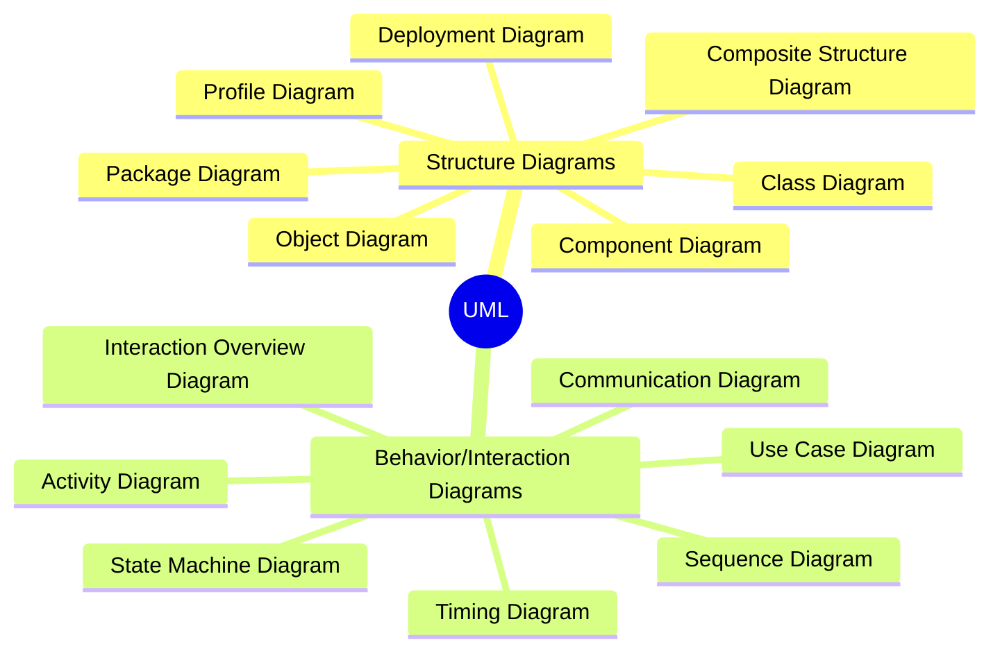
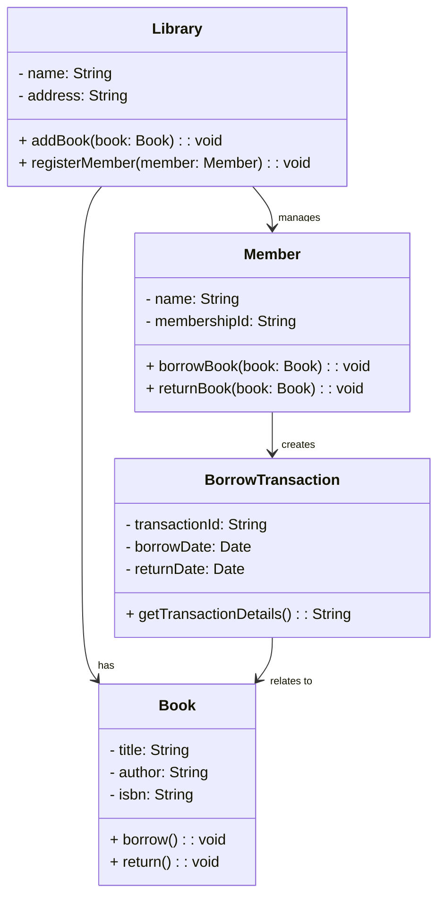
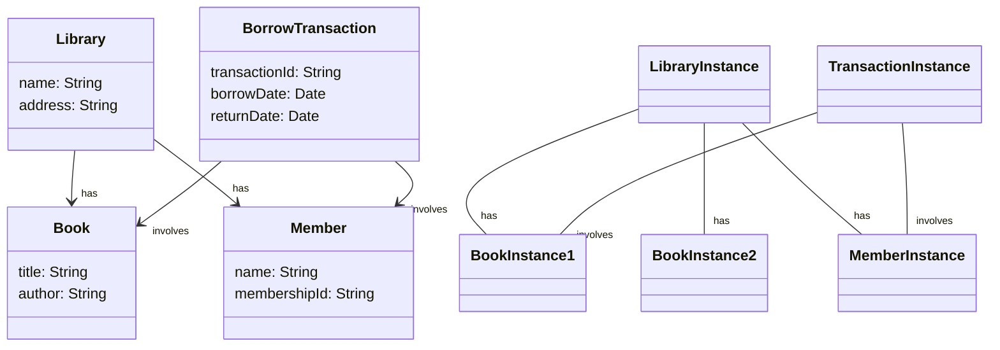
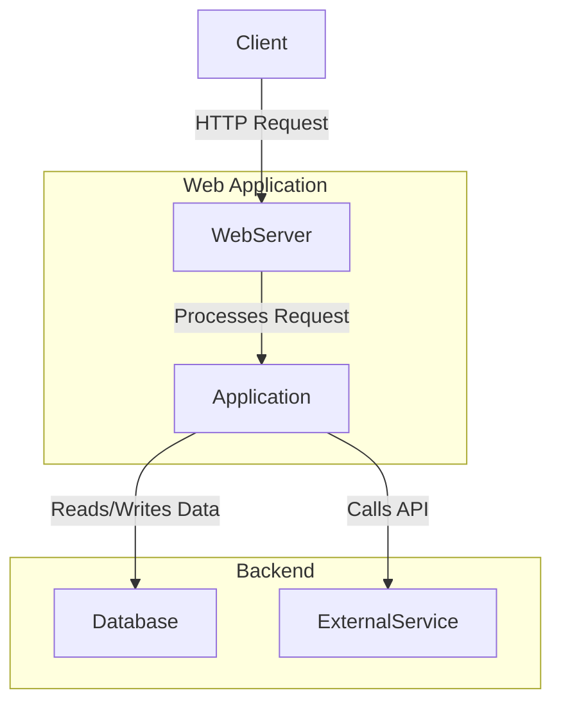
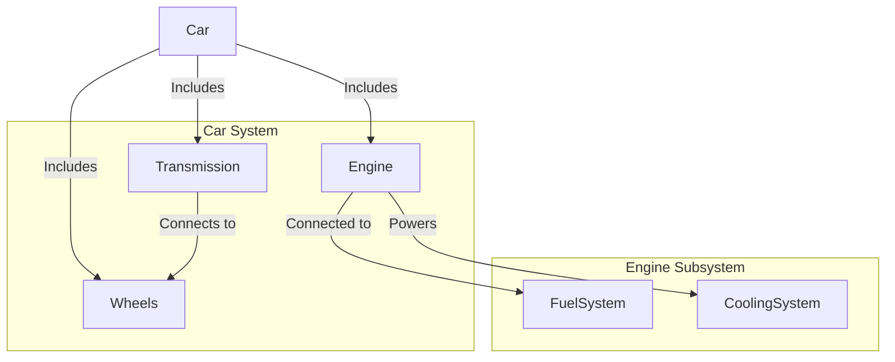
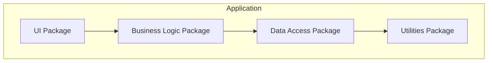

# UML 2

---

## Mindmap Example for UML Diagrams

## Table of Contents

1. [Structure Diagrams](#structure-diagrams)
   - [Class Diagram](#1-class-diagram)
   - [Object Diagram](#2-object-diagram)
   - [Component Diagram](#3-component-diagram)
   - [Composite Structure Diagram](#4-composite-structure-diagram)
   - [Deployment Diagram](#5-deployment-diagram)
   - [Package Diagram](#6-package-diagram)
   - [Profile Diagram](#7-profile-diagram)

2. [Behavior Diagrams](#behavior-diagrams)
   - [Use Case Diagram](#1-use-case-diagram)
   - [Activity Diagram](#2-activity-diagram)
   - [State Machine Diagram (State Diagram)](#3-state-machine-diagram-state-diagram)
   - [Sequence Diagram](#4-sequence-diagram)
   - [Communication Diagram](#5-communication-diagram)
   - [Interaction Overview Diagram](#6-interaction-overview-diagram)
   - [Timing Diagram](#7-timing-diagram)

4. [Summary Table](#summary-table)

## Structure Diagrams
These diagrams focus on the static structure of the system and its components.

### 1. Class Diagram
- **Purpose**: Describes the structure of the system by showing its classes, attributes, operations, and relationships (associations, generalizations, dependencies).
- **Use When**: You want to model the blueprint of the system, its objects, and their interconnections.

### 2. Object Diagram
- **Purpose**: Represents an instance of a class diagram showing specific object instances and their relationships at a particular point in time.
- **Use When**: You need a snapshot of the system at runtime (e.g., testing or debugging).

### 3. Component Diagram
- **Purpose**: Describes the high-level components (software modules) and their relationships, focusing on interfaces and dependencies between components.
- **Use When**: You want to show the architecture of the system in terms of components.

### 4. Composite Structure Diagram
- **Purpose**: Shows the internal structure of a class, component, or other classifiers, focusing on the internal interactions between parts.
- **Use When**: You need to illustrate the internal workings of a complex system or object.

### 5. Deployment Diagram
- **Purpose**: Models the physical deployment of software artifacts (executables, files, etc.) onto hardware nodes and devices.
- **Use When**: You are working on system architecture and need to model how software will run on physical hardware.

### 6. Package Diagram
- **Purpose**: Organizes elements of a system into related groups (packages) to illustrate the modular structure of the system.
- **Use When**: You need to organize and manage large systems by grouping related classes and components.

### 7. Profile Diagram
- **Purpose**: Allows the customization of UML models for particular domains (e.g., real-time, enterprise systems) by defining profiles, stereotypes, and tagged values.
- **Use When**: You are extending UML to model specific domains with custom constructs.

---

## Behavior Diagrams
These diagrams focus on the dynamic behavior of the system and interactions between elements over time.

### 1. Use Case Diagram
- **Purpose**: Describes the system's functionality from a user's perspective, showing interactions between users (actors) and system features (use cases).
- **Use When**: You are defining requirements and want to capture high-level user interactions with the system.

### 2. Activity Diagram
- **Purpose**: Models workflows and processes by showing the flow of control between activities (e.g., tasks, operations, or steps).
- **Use When**: You need to describe the logic of a system process, business workflow, or algorithm.

### 3. State Machine Diagram (State Diagram)
- **Purpose**: Depicts the states of an object throughout its lifecycle and the transitions between those states based on events.
- **Use When**: You want to model the behavior of an object that reacts to events, especially in real-time systems.

### 4. Sequence Diagram
- **Purpose**: Illustrates how objects interact in a particular scenario of a use case, focusing on the order of messages exchanged between objects.
- **Use When**: You want to model the flow of messages between objects over time in a specific sequence.

### 5. Communication Diagram
- **Purpose**: Similar to sequence diagrams but emphasizes the structure and relationships between objects, focusing on the network of messages passed.
- **Use When**: You want to focus on object interactions and their relationships rather than the order of events.

### 6. Interaction Overview Diagram
- **Purpose**: Provides an overview of how different interactions (such as sequence diagrams) fit together within a broader process or workflow.
- **Use When**: You need to depict the overall control flow between various interactions in a complex system.

### 7. Timing Diagram
- **Purpose**: Models the behavior of objects over time, focusing on time constraints and how object states change with time.
- **Use When**: Timing is a critical aspect of your system, and you need to ensure that certain actions occur at precise times.

---

## Summary Table

| **Diagram**                     | **Type**         | **Focus**                           | **Purpose**                                                |
|----------------------------------|------------------|-------------------------------------|------------------------------------------------------------|
| **Class Diagram**                | Structure        | Static structure                    | Describes classes, attributes, and relationships            |
| **Object Diagram**               | Structure        | Object instances                    | Snapshot of object instances and links                      |
| **Component Diagram**            | Structure        | Components and interfaces           | Depicts high-level system components and their relationships|
| **Composite Structure Diagram**  | Structure        | Internal structure                  | Shows internal parts and connectors                         |
| **Deployment Diagram**           | Structure        | Physical deployment                 | Maps software artifacts to hardware                         |
| **Package Diagram**              | Structure        | Modular grouping                    | Organizes elements into packages                            |
| **Profile Diagram**              | Structure        | Domain-specific extensions          | Customizes UML for specific domains                         |
| **Use Case Diagram**             | Behavior         | User interactions                   | Shows system functionality from a user’s perspective        |
| **Activity Diagram**             | Behavior         | Process/workflow                    | Models workflows, processes, and algorithms                 |
| **State Machine Diagram**        | Behavior         | Object lifecycle                    | Depicts states of an object and transitions between them     |
| **Sequence Diagram**             | Behavior/Interaction | Message order                        | Focuses on the sequence of interactions                     |
| **Communication Diagram**        | Behavior/Interaction | Object relationships                 | Shows object interactions and their relationships           |
| **Interaction Overview Diagram** | Behavior/Interaction | Control flow between interactions    | Provides an overview of interactions                        |
| **Timing Diagram**               | Behavior/Interaction | Time-based behavior                 | Models object behavior based on time constraints            |

---

## Links
- https://en.wikipedia.org/wiki/Unified_Modeling_Language
