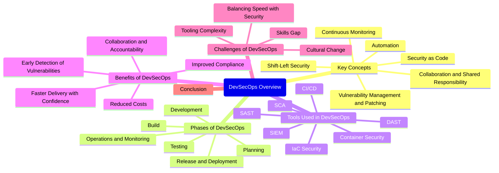

# Overview of DevSecOps

**DevSecOps** (Development, Security, and Operations) is an integrated approach to software development and operations that emphasizes the importance of security at every stage of the software development lifecycle (SDLC). Traditionally, security was treated as a separate process handled only at the end of the development cycle, but in modern software engineering practices, security is integrated directly into the development and deployment pipelines, ensuring that vulnerabilities are detected and mitigated as early as possible.

DevSecOps builds upon the principles of **DevOps**, which is an approach that focuses on the collaboration and integration between software development (Dev) and IT operations (Ops). DevSecOps takes this a step further by incorporating security into every phase of the pipeline. The goal is to make security a shared responsibility across the entire development process rather than the responsibility of a single team or a final-stage review.

## Key Concepts of DevSecOps

### 1. Shift-Left Security
Traditionally, security checks were performed late in the SDLC, often after the development process was complete. DevSecOps shifts security concerns to the left of the SDLC, meaning security testing starts as early as possible. This allows teams to identify and address security vulnerabilities before they become more complex and costly to fix later in the cycle.

### 2. Automation
Automation plays a key role in DevSecOps. Security testing tools are integrated into CI/CD (Continuous Integration and Continuous Deployment) pipelines, ensuring that security scans are automatically triggered with each new code commit, deployment, or update. Automated tests can check for vulnerabilities, misconfigurations, and other security issues without requiring manual intervention.

### 3. Collaboration and Shared Responsibility
In DevSecOps, security is a responsibility shared by development, security, and operations teams. This collaborative approach ensures that everyone is aware of security concerns and is responsible for building secure applications from the outset. The separation of duties is blurred, and each team works together throughout the entire SDLC.

### 4. Continuous Monitoring
DevSecOps emphasizes the need for continuous monitoring and feedback. Once an application is deployed, security should not be considered a one-time concern. Ongoing monitoring ensures that new vulnerabilities are identified and mitigated quickly, and any suspicious activities are promptly detected.

### 5. Security as Code
In DevSecOps, security is treated like any other aspect of code—programmable, repeatable, and auditable. This includes defining security policies, controls, and standards within the code itself, making security configuration part of the overall development pipeline. Infrastructure-as-code (IaC) is a common practice where environments are defined and provisioned via code, enabling automated security measures to be applied consistently across environments.

### 6. Vulnerability Management and Patching
Continuous vulnerability scanning tools are embedded into the pipeline to identify and address potential vulnerabilities early in development. These tools can assess third-party libraries, dependencies, and codebase for known vulnerabilities. Automated patching and fixes are also incorporated into DevSecOps pipelines, ensuring vulnerabilities are patched before they can be exploited.

## Phases of DevSecOps

### 1. Planning
Security requirements are integrated into the project’s planning phase. Threat modeling and risk assessments are conducted to identify security risks early in the development lifecycle.

### 2. Development
Developers are provided with secure coding guidelines and tools for static application security testing (SAST). The code is tested for vulnerabilities as it is written to ensure that security is embedded from the beginning.

### 3. Build
Security tools for checking open-source dependencies and libraries for known vulnerabilities are integrated into the build process. Tools like Software Composition Analysis (SCA) can help identify risks introduced by third-party components.

### 4. Testing
In addition to functional testing, automated security tests like dynamic application security testing (DAST) and interactive application security testing (IAST) are run to identify vulnerabilities that may only appear during runtime. Security teams continuously analyze and test for vulnerabilities in both static and dynamic environments.

### 5. Release and Deployment
Security is validated at the time of release and deployment. Container security, infrastructure security, and security posture management are applied. Vulnerability scanning and compliance checks ensure that the application adheres to security standards before it is deployed to production.

### 6. Operations and Monitoring
Security is continuously monitored in production, where logging, intrusion detection systems (IDS), and other security tools help identify and respond to security incidents. Security updates and patches are applied automatically to keep the infrastructure secure. Any anomalies or breaches are detected quickly, and incidents are managed using automated response tools.

## Tools Used in DevSecOps

Several tools are essential for implementing a DevSecOps pipeline, helping automate security tasks, monitor environments, and enforce security practices. These tools generally fall into different categories:

### 1. Static Application Security Testing (SAST)
- Tools like **SonarQube**, **Checkmarx**, and **Veracode** scan the source code to identify vulnerabilities early in the development phase.

### 2. Dynamic Application Security Testing (DAST)
- Tools like **OWASP ZAP** and **Burp Suite** test applications in a runtime environment, identifying vulnerabilities during execution.

### 3. Software Composition Analysis (SCA)
- Tools like **WhiteSource**, **Snyk**, and **Black Duck** analyze open-source libraries and dependencies to check for known vulnerabilities.

### 4. Infrastructure as Code (IaC) Security
- Tools like **Terraform**, **CloudFormation**, and **Pulumi** allow for the automation of cloud infrastructure and its secure configuration.

### 5. Container Security
- Tools like **Aqua Security**, **Twistlock**, and **Sysdig** help secure containers and containerized applications.

### 6. Continuous Integration/Continuous Deployment (CI/CD)
- Tools like **Jenkins**, **GitLab**, and **CircleCI** allow for the automation of building, testing, and deploying applications while integrating security at every stage.

### 7. Security Information and Event Management (SIEM)
- Tools like **Splunk** and **Elastic Stack** help in monitoring, logging, and detecting security incidents in real time.

## Benefits of DevSecOps

### 1. Early Detection of Vulnerabilities
By integrating security early into the development lifecycle, security flaws are detected and fixed before they can be exploited.

### 2. Reduced Costs
Identifying and addressing security issues early on is much cheaper than fixing vulnerabilities post-production. Additionally, automating security tasks reduces the overhead costs of manual security reviews.

### 3. Improved Compliance
DevSecOps helps organizations adhere to regulatory and industry security standards (e.g., GDPR, HIPAA, PCI-DSS) by ensuring that security best practices are followed at every stage.

### 4. Faster Delivery with Confidence
Continuous security testing ensures that applications can be delivered faster with confidence that they are secure. Teams can deploy updates frequently without sacrificing security.

### 5. Collaboration and Accountability
DevSecOps fosters a culture of shared responsibility for security. Developers, security teams, and operations staff all collaborate to ensure that security is continuously maintained.

## Challenges of DevSecOps

### 1. Cultural Change
Adopting DevSecOps requires a shift in mindset across the organization. The integration of security into development and operations requires collaboration and communication, which can be difficult in traditionally siloed teams.

### 2. Tooling Complexity
The wide array of security tools available may lead to complexity in integrating them into CI/CD pipelines. Choosing the right tools and ensuring they work together smoothly can be challenging.

### 3. Balancing Speed with Security
DevSecOps aims to accelerate software delivery without sacrificing security. However, finding the right balance between fast delivery and maintaining strong security practices is a constant challenge for organizations.

### 4. Skills Gap
DevSecOps requires a combination of skills in both development, security, and operations. Organizations may struggle to find or train staff with the necessary expertise in all areas.

## Conclusion

DevSecOps is a critical evolution of DevOps, integrating security into every phase of the development lifecycle to create more secure software. By prioritizing security early, automating security checks, and fostering collaboration between development, security, and operations teams, DevSecOps aims to ensure that vulnerabilities are identified and mitigated as early as possible, reducing the risk of security breaches and improving the overall security posture of the organization.
