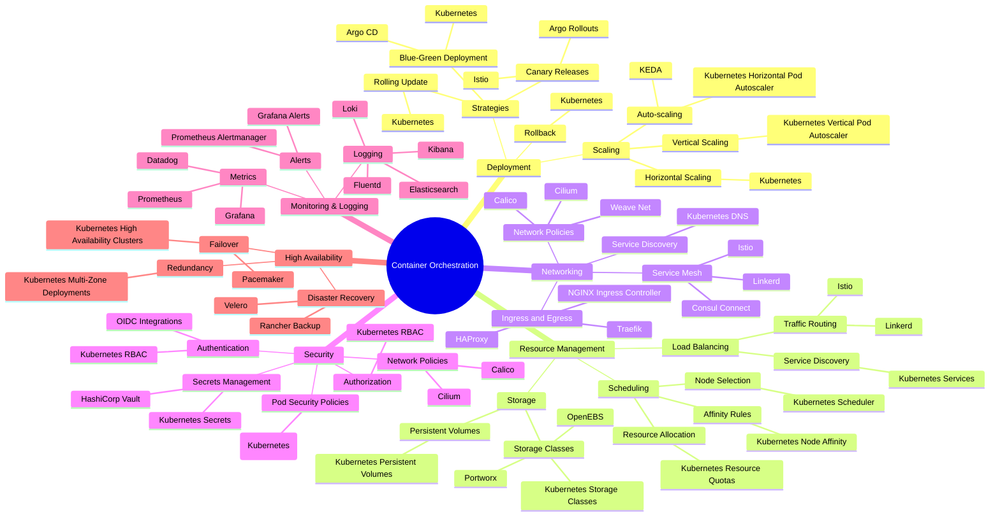

```mermaid
mindmap
   root((Container Orchestration))
      Deployment
         Strategies
            Rolling Update
               Kubernetes
            Blue-Green Deployment
               Kubernetes
               Argo CD
            Canary Releases
               Istio
               Argo Rollouts
         Scaling
            Auto-scaling
               Kubernetes Horizontal Pod Autoscaler
               KEDA
            Horizontal Scaling
               Kubernetes
            Vertical Scaling
               Kubernetes Vertical Pod Autoscaler
         Rollback
            Kubernetes
      Resource Management
         Scheduling
            Node Selection
               Kubernetes Scheduler
            Resource Allocation
               Kubernetes Resource Quotas
            Affinity Rules
               Kubernetes Node Affinity
         Load Balancing
            Service Discovery
               Kubernetes Services
            Traffic Routing
               Istio
               Linkerd
         Storage
            Persistent Volumes
               Kubernetes Persistent Volumes
            Storage Classes
               Kubernetes Storage Classes
               OpenEBS
               Portworx
      Networking
         Ingress and Egress
            NGINX Ingress Controller
            Traefik
            HAProxy
         Service Discovery
            Kubernetes DNS
         Service Mesh
            Istio
            Linkerd
            Consul Connect
         Network Policies
            Calico
            Cilium
            Weave Net
      Security
         Authentication
            Kubernetes RBAC
            OIDC Integrations
         Authorization
            Kubernetes RBAC
         Network Policies
            Calico
            Cilium
         Secrets Management
            Kubernetes Secrets
            HashiCorp Vault
         Pod Security Policies
            PodSecurityPolicies (Kubernetes)
      Monitoring & Logging
         Metrics
            Prometheus
            Grafana
            Datadog
         Logging
            Elasticsearch
            Fluentd
            Kibana
            Loki
         Alerts
            Prometheus Alertmanager
            Grafana Alerts
      High Availability
         Failover
            Kubernetes High Availability Clusters
            Pacemaker
         Redundancy
            Kubernetes Multi-Zone Deployments
         Disaster Recovery
            Velero
            Rancher Backup
```
