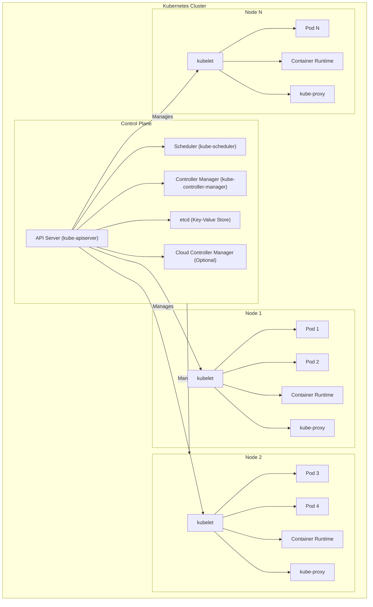

```mermaid
graph TD

    subgraph Kubernetes Cluster
        subgraph Control_Plane [Control Plane]
            API_Server["API Server (kube-apiserver)"]
            Scheduler["Scheduler (kube-scheduler)"]
            Controller_Manager["Controller Manager (kube-controller-manager)"]
            etcd["etcd (Key-Value Store)"]
            Cloud_Controller_Manager["Cloud Controller Manager (Optional)"]
            
            API_Server --> Scheduler
            API_Server --> Controller_Manager
            API_Server --> etcd
            API_Server --> Cloud_Controller_Manager
        end

        subgraph Node_1 [Node 1]
            kubelet_1["kubelet"]
            container_runtime_1["Container Runtime"]
            kube_proxy_1["kube-proxy"]
            pod1["Pod 1"]
            pod2["Pod 2"]

            kubelet_1 --> pod1
            kubelet_1 --> pod2
            kubelet_1 --> container_runtime_1
            kubelet_1 --> kube_proxy_1
        end

        subgraph Node_2 [Node 2]
            kubelet_2["kubelet"]
            container_runtime_2["Container Runtime"]
            kube_proxy_2["kube-proxy"]
            pod3["Pod 3"]
            pod4["Pod 4"]

            kubelet_2 --> pod3
            kubelet_2 --> pod4
            kubelet_2 --> container_runtime_2
            kubelet_2 --> kube_proxy_2
        end

        subgraph Node_N [Node N]
            kubelet_N["kubelet"]
            container_runtime_N["Container Runtime"]
            kube_proxy_N["kube-proxy"]
            podN["Pod N"]

            kubelet_N --> podN
            kubelet_N --> container_runtime_N
            kubelet_N --> kube_proxy_N
        end

        %% Connections between control plane and nodes
        API_Server --> kubelet_1
        API_Server --> kubelet_2
        API_Server --> kubelet_N

    end

    %% Labels
    Control_Plane -->|Manages| Node_1
    Control_Plane -->|Manages| Node_2
    Control_Plane -->|Manages| Node_N

```
