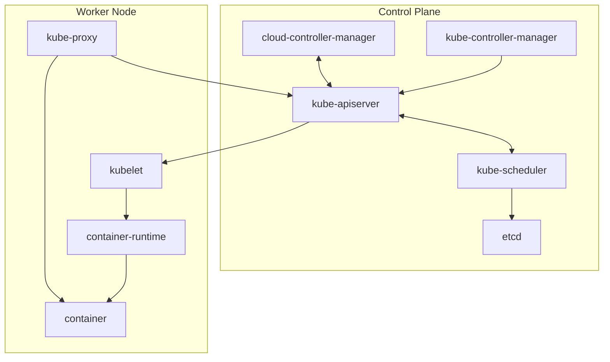

# Overview of the Kubernetes Control Plane

The **Kubernetes Control Plane** is responsible for managing and maintaining the overall state of a Kubernetes cluster. It makes global decisions about the cluster, such as scheduling applications, responding to cluster events (like deployments or failures), and maintaining the desired state of applications.

Here’s an overview of the core components that make up the Kubernetes Control Plane:

---

## 1. Kubernetes API Server (`kube-apiserver`)
- **Role:** Acts as the front-end to the Kubernetes Control Plane.
- **Function:** The API server exposes the Kubernetes API, which is used by all components and users to interact with the cluster. It processes RESTful API requests and communicates with the etcd database.
- **Details:** It validates and configures API objects, such as pods, services, replication controllers, and deployments. The API server is the central point of contact for all administrative tasks.

---

## 2. etcd
- **Role:** Key-value store for cluster data.
- **Function:** `etcd` is a distributed key-value store used to store all the cluster data, including the configuration, state, and metadata. It keeps the persistent record of the cluster’s state, ensuring consistency across all components.
- **Details:** `etcd` stores the desired state (e.g., number of replicas of a pod), current state, and other configurations. It is also used by other control plane components to watch for changes in state.

---

## 3. Kube Scheduler (`kube-scheduler`)
- **Role:** Decides which node will run a newly created pod.
- **Function:** The scheduler is responsible for assigning newly created pods to available nodes. It considers various factors, such as resource requirements, constraints, and affinity rules.
- **Details:** It reads the pod specifications, checks resource availability, and schedules the pods accordingly. The scheduler ensures that pods are distributed efficiently across the cluster.

---

## 4. Kube Controller Manager (`kube-controller-manager`)
- **Role:** Ensures the desired state of the cluster is maintained.
- **Function:** The controller manager runs a set of controllers that regulate the state of the cluster. It ensures that the actual state of the cluster matches the desired state defined by the user.
- **Details:** Some of the important controllers include:
    - **ReplicationController/ReplicaSet Controller:** Ensures the desired number of replicas of a pod are running.
    - **Deployment Controller:** Manages rolling updates and scaling of applications.
    - **StatefulSet Controller:** Manages the deployment of stateful applications.
    - **Job Controller:** Ensures jobs are executed to completion.
    - **Service Controller:** Ensures that services are correctly assigned to the pods.

---

## 5. Cloud Controller Manager (`cloud-controller-manager`)
- **Role:** Integrates with cloud services.
- **Function:** The cloud controller manager is responsible for managing cloud-specific resources (like LoadBalancers, persistent volumes, etc.). It allows Kubernetes to interact with various cloud provider APIs.
- **Details:** It abstracts cloud-specific functionality to ensure Kubernetes can work on different cloud platforms. It performs tasks such as managing node lifecycles, handling load balancers, and provisioning storage volumes.

---

## Communication Between Control Plane Components
- **Control Plane Components Communicate with Each Other:**
    - The **API server** serves as the central communication hub, with all control plane components interacting through it.
    - The **Scheduler** and **Controller Manager** use the API to watch for new pods and make decisions accordingly.
    - **etcd** ensures that the cluster state is persisted and consistent, enabling other components to read/write cluster data.

---

## Control Plane's Role in Cluster Management
1. **Desired vs. Actual State:** The control plane maintains the desired state (such as the number of replicas, container images, and network policies) and ensures that the actual state of the system matches this.
2. **Health Checks & Self-Healing:** The control plane constantly monitors the cluster. If any pod, node, or container fails to match the desired state, the control plane will trigger recovery actions, such as rescheduling pods or restarting containers.
3. **Scaling & Updates:** It is responsible for scaling applications (e.g., adding/removing replicas) and handling rolling updates with minimal downtime.

---

## High Availability of the Control Plane
- **Redundancy:** The control plane can be set up in a highly available configuration by running multiple instances of components (e.g., API servers, controllers, etc.) across different nodes. This ensures the cluster remains functional even if one or more components fail.
- **External etcd:** For high availability, etcd can be run in a cluster mode, ensuring that even if one instance fails, the data is preserved and accessible.

---

## Summary
The Kubernetes Control Plane is the central component of a Kubernetes cluster, orchestrating all management tasks, monitoring cluster state, and ensuring that applications are running as intended. It consists of several components, including the API server, etcd, scheduler, controller manager, and cloud controller manager. These components work together to ensure the cluster is healthy, scalable, and self-healing, providing a seamless experience for developers and administrators.

---

# Overview of Kubernetes Worker Node Components

In a Kubernetes cluster, worker nodes are the machines responsible for running applications in the form of pods. These nodes host the necessary components to ensure the smooth running and communication of the applications and services within the cluster. Each worker node typically runs the following key components: `kubelet`, `kube-proxy`, and the container runtime.

Here’s an overview of the main components running on a Kubernetes worker node:

---

## 1. **Kubelet**
- **Role:** Ensures the pods are running and healthy.
- **Function:** The `kubelet` is an agent that runs on each worker node. Its primary function is to ensure that the containers in the pods are running and in the desired state.
- **Details:**
    - The `kubelet` watches for pod specifications from the Kubernetes API server and makes sure that the containers are launched as per the requested configuration.
    - It performs health checks and reports the status of containers back to the control plane.
    - It also manages the lifecycle of containers, making sure they are running, restarted on failure, and terminated when necessary.
    - `kubelet` communicates with the container runtime (e.g., Docker, containerd) to start and stop containers as needed.

---

## 2. **Kube-proxy**
- **Role:** Maintains network rules and enables service communication.
- **Function:** The `kube-proxy` is a network proxy that runs on each worker node and maintains network rules for pod communication. It enables the communication between services and ensures that requests are routed to the correct pod.
- **Details:**
    - `kube-proxy` can work in different modes (IPTables or IPVS) to manage traffic and load balancing.
    - It maintains the IP address and port mapping for services, ensuring that the service abstraction is maintained and that traffic is properly forwarded to the right pod.
    - In the case of a service request, `kube-proxy` ensures that traffic is sent to a pod that is part of the service's endpoint.
    - It also supports load balancing by distributing the incoming traffic across multiple replicas of the pods.

---

## 3. **Container Runtime**
- **Role:** Manages the lifecycle of containers.
- **Function:** The container runtime is the software responsible for running containers on the worker node. It is the lowest-level component on the worker node and is used by the `kubelet` to start and stop containers as part of pod management.
- **Details:**
    - Examples of container runtimes include **Docker**, **containerd**, and **CRI-O**.
    - The runtime pulls container images, starts containers, manages their lifecycle, and ensures that containers run according to the configuration defined in the pod specs.

---

## 4. **Node Components and Communication**
- **Communication with the Control Plane:**
    - The worker nodes continuously communicate with the Kubernetes control plane, specifically the **API server**. This allows the `kubelet` to retrieve pod specifications and report the node’s health and status back to the control plane.
    - **Health Monitoring:** The `kubelet` ensures that the pods are running, and it reports the status of the pods (e.g., running, terminated, pending) to the control plane.

- **Networking with `kube-proxy`:**
    - The `kube-proxy` ensures that services are discoverable and accessible from anywhere in the cluster. It configures network rules to forward traffic to the correct pod and implements service load balancing to distribute incoming traffic.

---

## 5. **Additional Worker Node Services**
In some Kubernetes setups, there may be additional services running on the worker node:
- **Logging and Monitoring Agents:** Agents for logging (like Fluentd, Elasticsearch) or monitoring (like Prometheus, cAdvisor) might be installed to provide metrics and logs for troubleshooting and performance analysis.
- **DNS (CoreDNS):** If running on the node as part of a distributed service mesh or DNS resolution, **CoreDNS** may also run on worker nodes to handle service discovery via DNS.

---

## Summary
The worker node components are responsible for running the actual application workloads in a Kubernetes cluster. The key components are:
- **Kubelet:** Ensures containers are running and healthy according to the desired state.
- **Kube-proxy:** Manages network traffic and service communication within the cluster.
- **Container Runtime:** Handles the lifecycle of containers on the node.

Together, these components ensure that applications are deployed, running, and communicating properly across the cluster, while providing the necessary tools to manage containerized workloads.

