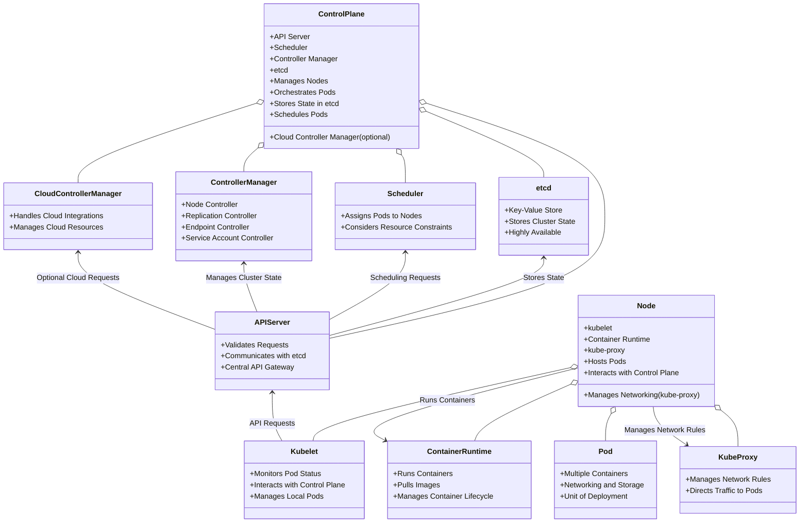

```mermaid
classDiagram

    %% Control Plane Components
    class ControlPlane {
        +API Server
        +Scheduler
        +Controller Manager
        +etcd
        +Cloud Controller Manager (optional)
    }
    
    ControlPlane : +Manages Nodes
    ControlPlane : +Orchestrates Pods
    ControlPlane : +Stores State in etcd
    ControlPlane : +Schedules Pods
    
    class APIServer {
        +Validates Requests
        +Communicates with etcd
        +Central API Gateway
    }
    
    class Scheduler {
        +Assigns Pods to Nodes
        +Considers Resource Constraints
    }
    
    class ControllerManager {
        +Node Controller
        +Replication Controller
        +Endpoint Controller
        +Service Account Controller
    }

    class etcd {
        +Key-Value Store
        +Stores Cluster State
        +Highly Available
    }

    class CloudControllerManager {
        +Handles Cloud Integrations
        +Manages Cloud Resources
    }

    %% Node Components
    class Node {
        +kubelet
        +Container Runtime
        +kube-proxy
    }
    
    Node : +Hosts Pods
    Node : +Interacts with Control Plane
    Node : +Manages Networking (kube-proxy)
    
    class Kubelet {
        +Monitors Pod Status
        +Interacts with Control Plane
        +Manages Local Pods
    }
    
    class ContainerRuntime {
        +Runs Containers
        +Pulls Images
        +Manages Container Lifecycle
    }

    class KubeProxy {
        +Manages Network Rules
        +Directs Traffic to Pods
    }

    %% Pod Class
    class Pod {
        +Multiple Containers
        +Networking and Storage
        +Unit of Deployment
    }

    %% Relationships
    ControlPlane o-- APIServer
    ControlPlane o-- Scheduler
    ControlPlane o-- ControllerManager
    ControlPlane o-- etcd
    ControlPlane o-- CloudControllerManager

    Node o-- Kubelet
    Node o-- ContainerRuntime
    Node o-- KubeProxy
    Node o-- Pod
    
    APIServer <-- Kubelet : API Requests
    etcd <-- APIServer : Stores State
    Scheduler <-- APIServer : Scheduling Requests
    ControllerManager <-- APIServer : Manages Cluster State
    CloudControllerManager <-- APIServer : Optional Cloud Requests
    KubeProxy <-- Node : Manages Network Rules
    ContainerRuntime <-- Node : Runs Containers
```
