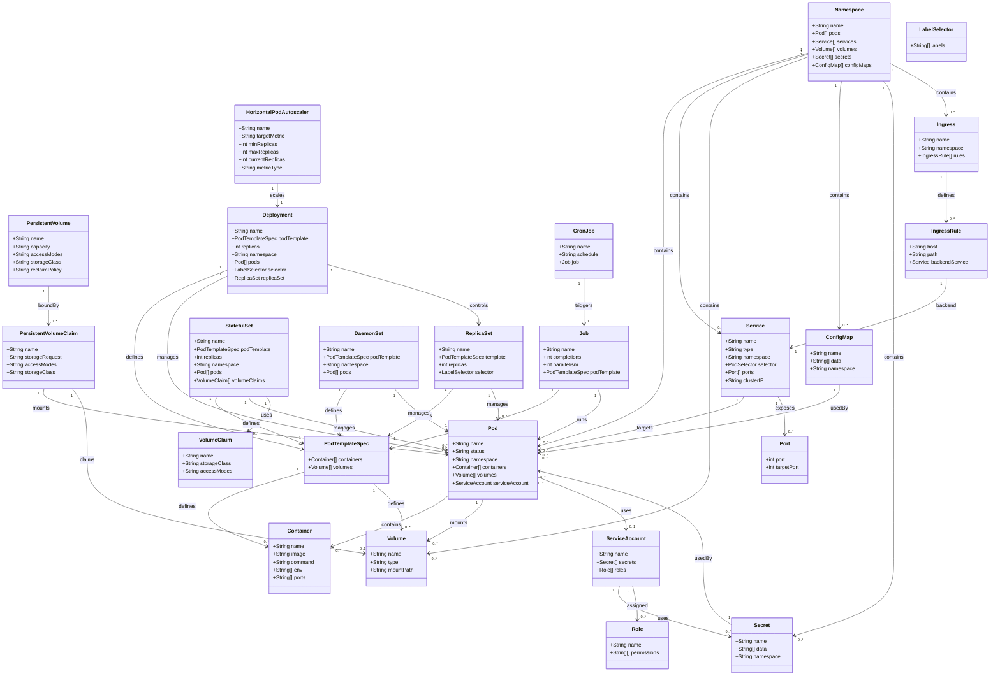

```mermaid
classDiagram
    class Pod {
        +String name
        +String status
        +String namespace
        +Container[] containers
        +Volume[] volumes
        +ServiceAccount serviceAccount
    }

    class Container {
        +String name
        +String image
        +String command
        +String[] env
        +String[] ports
    }

    class Volume {
        +String name
        +String type
        +String mountPath
    }

    class PersistentVolume {
        +String name
        +String capacity
        +String accessModes
        +String storageClass
        +String reclaimPolicy
    }

    class PersistentVolumeClaim {
        +String name
        +String storageRequest
        +String accessModes
        +String storageClass
    }

    class Service {
        +String name
        +String type
        +String namespace
        +PodSelector selector
        +Port[] ports
        +String clusterIP
    }

    class Namespace {
        +String name
        +Pod[] pods
        +Service[] services
        +Volume[] volumes
        +Secret[] secrets
        +ConfigMap[] configMaps
    }

    class ReplicaSet {
        +String name
        +PodTemplateSpec template
        +int replicas
        +LabelSelector selector
    }

    class Deployment {
        +String name
        +PodTemplateSpec podTemplate
        +int replicas
        +String namespace
        +Pod[] pods
        +LabelSelector selector
        +ReplicaSet replicaSet
    }

    class StatefulSet {
        +String name
        +PodTemplateSpec podTemplate
        +int replicas
        +String namespace
        +Pod[] pods
        +VolumeClaim[] volumeClaims
    }

    class DaemonSet {
        +String name
        +PodTemplateSpec podTemplate
        +String namespace
        +Pod[] pods
    }

    class Job {
        +String name
        +int completions
        +int parallelism
        +PodTemplateSpec podTemplate
    }

    class CronJob {
        +String name
        +String schedule
        +Job job
    }

    class HorizontalPodAutoscaler {
        +String name
        +String targetMetric
        +int minReplicas
        +int maxReplicas
        +int currentReplicas
        +String metricType
    }

    class Ingress {
        +String name
        +String namespace
        +IngressRule[] rules
    }

    class IngressRule {
        +String host
        +String path
        +Service backendService
    }

    class ConfigMap {
        +String name
        +String[] data
        +String namespace
    }

    class Secret {
        +String name
        +String[] data
        +String namespace
    }

    class ServiceAccount {
        +String name
        +Secret[] secrets
        +Role[] roles
    }

    class Role {
        +String name
        +String[] permissions
    }

    class Port {
        +int port
        +int targetPort
    }

    class LabelSelector {
        +String[] labels
    }

    class PodTemplateSpec {
        +Container[] containers
        +Volume[] volumes
    }

    class VolumeClaim {
        +String name
        +String storageClass
        +String accessModes
    }

    Pod "1" --> "0..*" Container : contains
    Pod "1" --> "0..*" Volume : mounts
    ReplicaSet "1" --> "1" PodTemplateSpec : defines
    ReplicaSet "1" --> "0..*" Pod : manages
    Deployment "1" --> "1" PodTemplateSpec : defines
    Deployment "1" --> "0..*" Pod : manages
    Deployment "1" --> "1" ReplicaSet : controls
    StatefulSet "1" --> "1" PodTemplateSpec : defines
    StatefulSet "1" --> "0..*" Pod : manages
    StatefulSet "1" --> "0..*" VolumeClaim : uses
    DaemonSet "1" --> "1" PodTemplateSpec : defines
    DaemonSet "1" --> "0..*" Pod : manages
    Job "1" --> "1" PodTemplateSpec : defines
    Job "1" --> "0..*" Pod : runs
    CronJob "1" --> "1" Job : triggers
    HorizontalPodAutoscaler "1" --> "1" Deployment : scales
    Service "1" --> "0..*" Pod : targets
    Service "1" --> "0..*" Port : exposes
    Namespace "1" --> "0..*" Pod : contains
    Namespace "1" --> "0..*" Service : contains
    Namespace "1" --> "0..*" Volume : contains
    Namespace "1" --> "0..*" ConfigMap : contains
    Namespace "1" --> "0..*" Secret : contains
    Namespace "1" --> "0..*" Ingress : contains
    ServiceAccount "1" --> "0..*" Secret : uses
    ServiceAccount "1" --> "0..*" Role : assigned
    Pod "0..*" --> "0..1" ServiceAccount : uses
    Ingress "1" --> "0..*" IngressRule : defines
    IngressRule "1" --> "1" Service : backend
    ConfigMap "1" --> "0..*" Pod : usedBy
    Secret "1" --> "0..*" Pod : usedBy
    PodTemplateSpec "1" --> "0..*" Container : defines
    PodTemplateSpec "1" --> "0..*" Volume : defines
    PersistentVolume "1" --> "0..*" PersistentVolumeClaim : boundBy
    PersistentVolumeClaim "1" --> "0..*" Pod : mounts
    PersistentVolumeClaim "1" --> "0..1" Volume : claims
```
