# Kubernetes Patterns from *Kubernetes Patterns* by Roland Huß

https://github.com/k8spatterns/examples

## 1. Foundational Patterns
Foundational patterns are essential constructs that help set up the base for deploying applications on Kubernetes.

- **Predictable Demands:** Designing for known usage demands, allowing resources to be allocated effectively.
- **Declarative Deployment:** Using declarative manifests (YAML) to define and deploy applications.
- **Self-Healing:** Leveraging Kubernetes' built-in capabilities for self-healing, such as automatic restarts and rescheduling.
- **Automated Scheduling:** Letting Kubernetes handle scheduling decisions to optimize resource utilization and workload placement.

## 2. Behavioral Patterns
These patterns focus on managing the application's runtime behavior on Kubernetes.

- **Health Probe:** Using readiness and liveness probes to monitor and manage application health.
- **Predictable Scheduling:** Ensuring applications are placed in predictable locations or nodes.
- **Managed Lifecycle:** Leveraging lifecycle hooks to handle pre- and post-start behaviors.
- **Configuration Resource:** Managing environment-specific configurations, such as with ConfigMaps and Secrets.
- **Resource Management:** Defining resource requests and limits to control application resource usage.

## 3. Structural Patterns
Structural patterns address ways to architect applications and services for modularity, scalability, and resilience.

- **Sidecar:** Extending the functionality of a primary application container by pairing it with auxiliary containers (e.g., logging, monitoring).
- **Adapter:** Creating compatibility layers between services, such as API gateways or protocol translators.
- **Ambassador:** Configuring a helper container that acts as a proxy to external services or APIs.
- **Init Container:** Running one-time setup tasks using Init Containers before starting the main application container.
- **Leader Election:** Ensuring that only one instance of a pod assumes a leadership role in a multi-instance deployment.

## 4. Configuration Patterns
Configuration patterns focus on effectively managing configuration data for cloud-native applications.

- **Configuration Resource:** Using Kubernetes resources like ConfigMaps and Secrets for externalized configuration management.
- **Environment Variable Configuration:** Passing configurations as environment variables to applications, making them more flexible.
- **Configuration Template:** Using templates and parameterized configurations to customize application deployments across environments.

## 5. Advanced Patterns
These patterns are geared towards more sophisticated use cases and deployment scenarios, such as optimizing resource usage and scaling dynamically.

- **Autoscaling:** Leveraging Horizontal Pod Autoscaler and Vertical Pod Autoscaler for dynamic scaling based on load.
- **Stateful Services:** Managing stateful applications with StatefulSets for predictable identities and storage management.
- **Operator:** Using custom controllers (Operators) to extend Kubernetes' API for managing complex applications (e.g., databases).
- **Multi-Cluster Deployment:** Coordinating deployments across multiple Kubernetes clusters for redundancy and global reach.

## 6. Observability Patterns
Observability patterns provide strategies for monitoring, logging, and tracing applications on Kubernetes.

- **Log Aggregation:** Centralizing and managing logs using tools like Fluentd and Elasticsearch.
- **Metrics Collection:** Gathering application and cluster metrics with Prometheus or other monitoring tools.
- **Distributed Tracing:** Implementing tracing across services for visibility into distributed transactions (e.g., with Jaeger or OpenTracing).
- **Health Monitoring:** Using Kubernetes health checks alongside external monitoring solutions for comprehensive system health.

```mermaid
flowchart TD
A[Foundational Patterns]
B[Behavioral Patterns]
C[Structural Patterns]
D[Configuration Patterns]
E[Advanced Patterns]
F[Observability Patterns]

%% Foundational Patterns
A1[Predictable Demands]
A2[Declarative Deployment]
A3[Self-Healing]
A4[Automated Scheduling]

A --> A1
A --> A2
A --> A3
A --> A4

%% Behavioral Patterns
B1[Health Probe]
B2[Predictable Scheduling]
B3[Managed Lifecycle]
B4[Configuration Resource]
B5[Resource Management]

B --> B1
B --> B2
B --> B3
B --> B4
B --> B5

%% Structural Patterns
C1[Sidecar]
C2[Adapter]
C3[Ambassador]
C4[Init Container]
C5[Leader Election]

C --> C1
C --> C2
C --> C3
C --> C4
C --> C5

%% Configuration Patterns
D1[Configuration Resource]
D2[Environment Variable Configuration]
D3[Configuration Template]

D --> D1
D --> D2
D --> D3

%% Advanced Patterns
E1[Autoscaling]
E2[Stateful Services]
E3[Operator]
E4[Multi-Cluster Deployment]

E --> E1
E --> E2
E --> E3
E --> E4

%% Observability Patterns
F1[Log Aggregation]
F2[Metrics Collection]
F3[Distributed Tracing]
F4[Health Monitoring]

F --> F1
F --> F2
F --> F3
F --> F4
```

