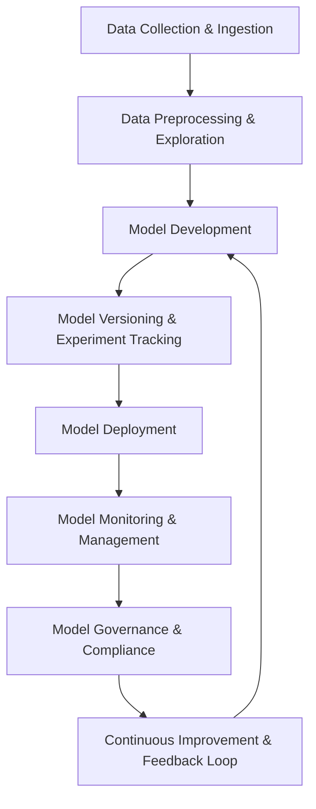

# LLMOps Cycle Overview

LLMOps (Large Language Model Operations) is the practice of managing and deploying large language models (LLMs) in production environments, with a focus on the specific needs of handling LLMs, including training, fine-tuning, serving, and maintaining them at scale. LLMOps combines the best practices from both MLOps and the unique challenges that come with working with large, complex models.

## 1. Data Collection & Ingestion
- **Data Acquisition**: Collect diverse and high-quality text data from various sources (e.g., websites, books, academic papers, code repositories).
- **Data Ingestion**: Efficiently ingest vast amounts of unstructured text data into storage solutions (e.g., data lakes, cloud storage).

## 2. Data Preprocessing & Exploration
- **Data Cleaning**: Remove noisy or irrelevant text, such as stop words, excessive formatting, or non-contextual data.
- **Data Transformation**: Tokenization, text normalization, and encoding to prepare text for model training.
- **Exploratory Data Analysis (EDA)**: Analyze text data to understand distribution, identify patterns, and visualize relationships between text features.

## 3. Model Development
- **Model Selection**: Choose the base model architecture (e.g., GPT, BERT, T5) or decide on custom model building approaches for domain-specific tasks.
- **Model Pretraining**: Pretrain large language models on diverse, large-scale datasets to learn general linguistic patterns.
- **Fine-tuning**: Fine-tune the pre-trained model on task-specific datasets (e.g., sentiment analysis, question answering, translation).
- **Model Evaluation**: Evaluate the model using NLP-specific metrics (e.g., perplexity, BLEU score, F1-score, accuracy).

## 4. Model Versioning & Experiment Tracking
- **Model Versioning**: Maintain versions of models and datasets to track improvements and changes.
- **Experiment Tracking**: Log all model training runs, hyperparameters, performance metrics, and training data to ensure reproducibility and comparison.

## 5. Model Deployment
- **Model Deployment**: Deploy the LLM to production environments, either on-premises or in the cloud, using infrastructure that can handle high computation and storage needs.
- **Model Serving**: Expose the model through APIs, supporting real-time inference for tasks like text generation, summarization, or answering questions.
- **Model Optimization**: Use techniques such as quantization, pruning, or distillation to optimize model size and inference time for deployment.

## 6. Model Monitoring & Management
- **Model Monitoring**: Track the performance and resource utilization of the deployed LLMs (e.g., latency, throughput, resource consumption).
- **Model Evaluation**: Continuously evaluate the LLM's output for quality, relevance, and accuracy, especially in production.
- **Drift Detection**: Detect changes in input data distributions or model performance that may indicate concept drift.
- **Model Retraining**: Periodically retrain models with new data to ensure the model stays up to date with changing language patterns and contexts.

## 7. Model Governance & Compliance
- **Audit Trails**: Maintain detailed logs of model versions, training data, and deployment history for regulatory compliance and transparency.
- **Ethical AI & Fairness**: Assess the model for ethical issues such as bias, fairness, and inclusivity in text generation or decision-making.
- **Regulatory Compliance**: Ensure models comply with industry regulations, such as GDPR, HIPAA, and others, for sensitive data handling.

## 8. Continuous Improvement & Feedback Loop
- **User Feedback**: Gather feedback from users or clients regarding the quality, relevance, and performance of the generated text or model predictions.
- **Iterative Model Improvement**: Use feedback and monitoring data to iterate and refine the model, improving accuracy, efficiency, and overall user experience.

## Key Tools & Technologies in the LLMOps Cycle
- **Version Control**: Git, DVC (Data Version Control)
- **Data Pipelines**: Apache Airflow, Kubeflow, Prefect
- **Model Training**: Hugging Face Transformers, TensorFlow, PyTorch, DeepSpeed
- **Model Deployment**: Docker, Kubernetes, TensorFlow Serving, Triton Inference Server, AWS SageMaker, Google AI Platform
- **Model Optimization**: ONNX, TensorRT, Hugging Face Distill, NVIDIA TensorRT
- **Monitoring**: Prometheus, Grafana, ELK stack, OpenTelemetry
- **Collaboration**: GitHub, GitLab, Jira, Slack, Confluence
- **Experiment Tracking**: MLflow, Weights & Biases, Comet

## Summary
LLMOps focuses on managing the lifecycle of large language models in production environments, ensuring they are developed, deployed, monitored, and maintained efficiently. It combines traditional MLOps best practices with the specific challenges of handling large models, enabling continuous model improvement, ethical AI management, and smooth operation at scale.
