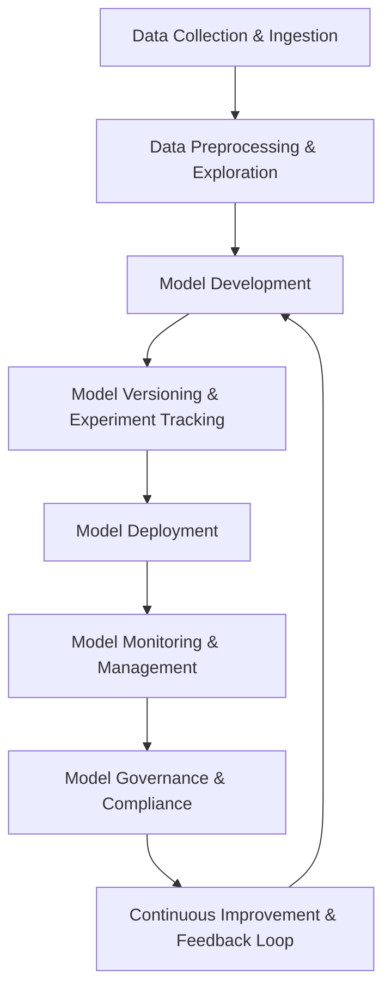

# MLOps Cycle Overview

The MLOps (Machine Learning Operations) cycle is a framework that integrates machine learning (ML) systems development with the principles and practices of DevOps to streamline the deployment and management of ML models in production. It involves continuous collaboration between data scientists, software engineers, and operations teams to ensure efficient, reproducible, and scalable model delivery.

## 1. Data Collection & Ingestion
- **Data Acquisition**: Collect raw data from various sources (e.g., databases, APIs, logs, sensors, or external datasets).
- **Data Ingestion**: Transfer data from various sources into the data warehouse or data lake for preprocessing and training.

## 2. Data Preprocessing & Exploration
- **Data Cleaning**: Handle missing values, outliers, and irrelevant features to clean the data.
- **Data Transformation**: Normalize, scale, or encode data as required for modeling.
- **Exploratory Data Analysis (EDA)**: Perform statistical analysis and visualizations to gain insights into data distributions and relationships.

## 3. Model Development
- **Feature Engineering**: Create meaningful features from raw data to improve model performance.
- **Model Selection**: Choose appropriate algorithms and architectures based on problem requirements (e.g., regression, classification, deep learning).
- **Model Training**: Train models using selected data, tuning hyperparameters and performing cross-validation.
- **Model Evaluation**: Evaluate model performance using validation and test sets, calculating metrics like accuracy, precision, recall, and F1-score.

## 4. Model Versioning & Experiment Tracking
- **Model Versioning**: Track versions of models, datasets, and training code.
- **Experiment Tracking**: Log experiments, hyperparameters, and performance metrics to ensure reproducibility and facilitate comparison.

## 5. Model Deployment
- **Continuous Integration (CI)**: Automate testing of model code and pipeline to ensure smooth integration into production systems.
- **Model Deployment**: Deploy models to production environments, such as cloud services, containers (e.g., Docker), or Kubernetes clusters.
- **Model Serving**: Expose the trained model via APIs or other interfaces for real-time or batch inference.

## 6. Model Monitoring & Management
- **Model Monitoring**: Continuously track model performance (e.g., drift in accuracy, latency) and data quality.
- **Model Performance Analytics**: Monitor key performance metrics and ensure the model continues to meet business objectives.
- **Model Retraining**: Retrain the model periodically using updated data, adjusting for performance degradation or concept drift.

## 7. Model Governance & Compliance
- **Audit Trails**: Maintain comprehensive logs of model development, versioning, and deployment to ensure transparency and compliance.
- **Bias & Fairness Checks**: Regularly assess models for fairness, ethical considerations, and bias.
- **Regulatory Compliance**: Ensure the model adheres to legal and industry-specific regulations (e.g., GDPR, HIPAA).

## 8. Continuous Improvement & Feedback Loop
- **User Feedback**: Collect user or customer feedback to improve model accuracy and relevancy.
- **Iterative Model Improvement**: Continuously iterate and refine the model to enhance its capabilities and adapt to changing data.

## Key Tools & Technologies in the MLOps Cycle
- **Version Control**: Git, DVC (Data Version Control)
- **Data Pipelines**: Apache Airflow, Kubeflow, Prefect
- **Model Training & Experimentation**: TensorFlow, PyTorch, Scikit-learn, MLflow
- **Model Deployment**: Docker, Kubernetes, Terraform, AWS SageMaker, Azure ML, Google AI Platform
- **Monitoring**: Prometheus, Grafana, ELK stack
- **Collaboration**: GitHub, GitLab, Jira, Slack
- **Model Registry**: MLflow, ModelDB

## Summary
The MLOps cycle is a continuous and iterative process that ensures machine learning models are consistently improved, deployed, and maintained in a scalable, efficient, and reproducible manner. It integrates traditional DevOps practices with ML workflows to streamline the model lifecycle from development to production.

