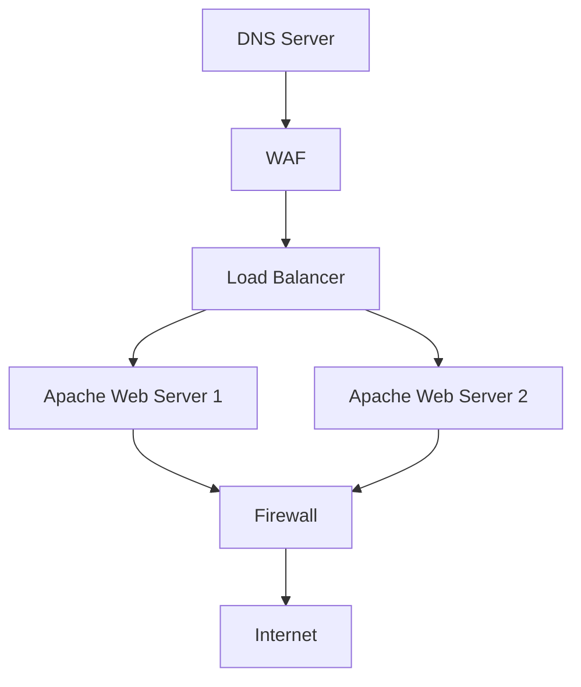

# System Architecture for Traffic Routing and Inspection



# System Architecture for Traffic Routing and Inspection

## **1. DNS Server**
- **Technology Used**: BIND (Berkeley Internet Name Domain)
- Resolves domain names to the IP address of the **WAF**.
- Acts as the entry point for incoming traffic.

### **Simple Configuration (BIND Zone File)**
```plaintext
# Tool: BIND DNS Server
# DNS Zone File for example.com
$TTL 86400
@   IN  SOA ns1.example.com. admin.example.com. (
        2025011201 ; Serial
        3600       ; Refresh
        1800       ; Retry
        1209600    ; Expire
        86400      ; Minimum TTL
)

@   IN  NS   ns1.example.com.
@   IN  A    192.168.1.50 ; IP of the WAF
www IN  A    192.168.1.50
```

---

## **2. Web Application Firewall (WAF)**
- **Technology Used**: ModSecurity (Apache WAF)
- Inspects and filters incoming traffic for potential threats before it reaches the Load Balancer.
- Configured to forward safe traffic to the **Load Balancer**.

```plaintext
# Tool: Apache with ModSecurity
<VirtualHost *:80>
    ServerName example.com

    # Enable ModSecurity
    SecRuleEngine On

    # Forward traffic to the Load Balancer
    ProxyPass / http://192.168.1.100/
    ProxyPassReverse / http://192.168.1.100/
</VirtualHost>
```

---

## **3. Load Balancer**
- **Technology Used**: HAProxy
- Distributes incoming traffic to multiple **Apache Web Servers** to balance the load and improve system performance.
- Ensures high availability and scalability.

```plaintext
# Tool: HAProxy
frontend http_front
    bind *:80
    default_backend http_back

backend http_back
    balance roundrobin
    server web1 192.168.1.101:80 check
    server web2 192.168.1.102:80 check
```

---

## **4. Apache Web Servers**
- **Technology Used**: Apache HTTP Server
- Host the web application or website.
- Process requests from the **Load Balancer** and generate responses.
- Outgoing traffic from Apache is routed to the **Firewall** for inspection before leaving the system.

```plaintext
# Tool: Apache HTTP Server
<VirtualHost *:80>
    ServerName www.example.com
    DocumentRoot /var/www/html

    <Directory /var/www/html>
        AllowOverride All
        Require all granted
    </Directory>
</VirtualHost>
```
---

## **5. Firewall**
- **Technology Used**: iptables (Linux Firewall)
- Acts as a gateway for all outgoing traffic from the **Apache Web Servers**.
- Inspects, filters, and logs outgoing traffic to ensure compliance with security policies.
- Can block malicious or unauthorized outbound connections.

```plaintext
# Tool: iptables (Linux Firewall)
# Enable IP forwarding on the firewall
echo 1 > /proc/sys/net/ipv4/ip_forward

# NAT for outgoing traffic
iptables -t nat -A POSTROUTING -o eth0 -j MASQUERADE

# Allow traffic from Apache servers to the internet
iptables -A FORWARD -s 192.168.1.101 -j ACCEPT
iptables -A FORWARD -s 192.168.1.102 -j ACCEPT
iptables -A FORWARD -d 0.0.0.0/0 -o eth0 -j ACCEPT
```
---

## **Traffic Flow**
1. **Incoming Traffic**:
   - Users send requests to the **DNS Server**, which resolves the domain to the IP of the **WAF**.
   - Traffic is inspected by the **WAF** for security threats.
   - Safe traffic is forwarded to the **Load Balancer**.
   - The **Load Balancer** distributes requests to the **Apache Web Servers**.

2. **Outgoing Traffic**:
   - Outgoing traffic from the **Apache Web Servers** is routed to the **Firewall**.
   - The **Firewall** inspects and filters outgoing traffic before allowing it to proceed to external destinations.

---

## **Key Benefits of the Architecture**
- **Security**: The **WAF** protects against inbound threats, while the **Firewall** ensures outbound traffic complies with security policies.
- **Scalability**: The **Load Balancer** enables the system to handle high traffic volumes by distributing the load across multiple servers.
- **Reliability**: DNS resolution, traffic filtering, and load balancing work together to ensure high availability.
- **Traffic Control**: The firewall enforces strict controls over outgoing traffic, enhancing the overall system security.

---

## **Components Overview**
| Component         | Role                                    | Technology Used            |
|-------------------|-----------------------------------------|----------------------------|
| **DNS Server**    | Resolves domain names to IP addresses. | BIND                        |
| **WAF**           | Inspects incoming traffic for threats. | ModSecurity (Apache WAF)    |
| **Load Balancer** | Distributes traffic across servers.    | HAProxy                     |
| **Apache**        | Hosts the web application.             | Apache HTTP Server          |
| **Firewall**      | Inspects and filters outgoing traffic. | iptables (Linux Firewall)   |

---

## **Future Enhancements**
- Add **Monitoring Tools** (e.g., Prometheus, Grafana) to visualize traffic and system performance.
- Use **Intrusion Detection Systems (IDS)** (e.g., Snort, Suricata) for deeper packet inspection.
- Implement **TLS/SSL Offloading** at the **Load Balancer** or **WAF** for enhanced security.
