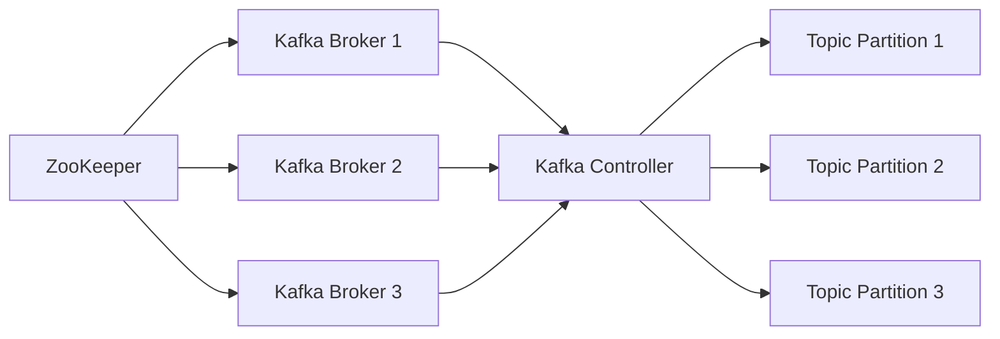

# Kafka Architecture with Brokers, ZooKeeper, and Controller

Kafka is a distributed streaming platform composed of several key components that work together to provide a scalable and fault-tolerant system for processing real-time data. Below is a detailed overview of the Kafka architecture, including brokers, ZooKeeper, and the Kafka controller.

## Table of Contents
- [Kafka Architecture](#kafka-architecture)
- [Kafka Components](#kafka-components)
- [Kafka Consumers and Partitions](#kafka-consumers-and-partitions)
- [Best Practices for Multiple Consumers](#best-practices-for-multiple-consumers-in-kafka)
- [Kafka Consumer Groups](#kafka-consumer-groups)
- [Kafka Security Protocols](#kafka-security-protocols)
- [Kafka Connect - Connector Storage](#kafka-connect)
- [Monitoring](#monitoring)
- [Kafka Producer Guarantees](#kafka-producer-delivery-guarantees-and-idempotence)

## Kafka Architecture



---

## Kafka Components:

1. **ZooKeeper**:
  - ZooKeeper manages metadata and coordinates Kafka brokers.
  - It handles tasks like leader election, broker discovery, and cluster membership.
  - Kafka relies on ZooKeeper to maintain the configuration and state of the cluster.

2. **Kafka Brokers**:
  - Kafka brokers are responsible for storing and serving data.
  - Brokers handle incoming messages, store them in partitions, and serve data to consumers.
  - Each broker can manage multiple partitions of a topic.
  - Kafka brokers work together to form a Kafka cluster, with each broker handling a portion of the partitions.

3. **Kafka Controller**:
  - The Kafka Controller is a special broker that ensures the overall health of the Kafka cluster.
  - It is responsible for tasks like partition leadership, rebalancing partitions across brokers, and handling replication.
  - The controller ensures that each partition has one leader broker, and other brokers are followers.

4. **Topic Partitions**:
  - Kafka topics are divided into partitions, which allow data to be distributed across multiple brokers.
  - Each partition has a leader broker that handles all reads and writes to that partition, while the other brokers replicate the data as followers.
  - Partitions help scale Kafka and provide fault tolerance by replicating data across brokers.

---


# Kafka Consumers and Partitions

## Key Concepts of Partitions and Consumers

### 1. Partitions in a Topic
- A **partition** is a log of messages, where messages are ordered by an offset. Each partition is independent and can be read by consumers in parallel.
- A Kafka topic can have one or more partitions. The number of partitions determines the level of parallelism available for reading data from that topic.

### 2. Consumer and Partition Assignment
- Each **consumer** in a **consumer group** is assigned one or more partitions. Kafka ensures that **each partition is consumed by only one consumer in the group at a time**.
- If a topic has multiple partitions and you have **multiple consumers in a consumer group**, Kafka will distribute these partitions among the consumers. Each consumer will read from a subset of partitions.
- If there is **only one consumer** in the group, that consumer will read from all partitions of the topic(s) it subscribes to.

### 3. Multiple Topics and Partitions
When a **single consumer subscribes to multiple topics**, Kafka will assign the consumer partitions from each topic. Here’s how the assignment works:
- If you subscribe to two topics (`topic1` with 3 partitions and `topic2` with 2 partitions), the consumer will be assigned partitions from both topics.
    - For example, if there is a total of 5 partitions across the two topics, Kafka will distribute these partitions to the consumer.
    - The consumer will read messages from all 5 partitions, with Kafka ensuring that **each partition is only assigned to one consumer** (if you have only one consumer in the group).

### 4. Partitioning and Parallelism
- Kafka consumers can process messages in parallel across partitions. If you have multiple consumers in a consumer group and multiple partitions, Kafka will distribute the partitions among the consumers.
    - For example, with 5 partitions and 2 consumers, each consumer will typically be assigned 2 or 3 partitions to read from, depending on how Kafka balances the assignment.

- **Increased Parallelism**: To increase processing parallelism, you can increase the number of consumers (up to the number of partitions). Each consumer will handle the messages from the partitions it’s assigned to. If there are more consumers than partitions, some consumers will remain idle.

### 5. Rebalancing
- When a new consumer joins the consumer group, or if a consumer fails, Kafka will **rebalance the partitions** among the consumers in the group. This rebalancing ensures that each partition is still assigned to exactly one consumer, and the load is distributed evenly.
- For example, if you add a new consumer to a group, Kafka will redistribute partitions among the consumers so that each consumer gets roughly the same number of partitions.

### 6. How Consumers Track Offsets
- Kafka tracks the offset for each partition independently. A **consumer group** keeps track of which message has been consumed from each partition, and this offset is committed to Kafka.
- **Offset Management**: Consumers either commit the offset automatically or manually. If you have multiple topics, the consumer will track offsets separately for each partition in each subscribed topic.

### 7. Message Consumption from Partitions
- **Order**: Within a partition, messages are strictly ordered. So, a consumer will always read messages in the same order they were written in a partition.
- **Across Partitions**: There is **no global ordering** of messages across different partitions of the same topic. Therefore, messages from different partitions may be consumed by the consumer in an interleaved manner, but the order is maintained **within each partition**.

### Example Scenario:
Let’s say you have two topics, `topic1` and `topic2`, and you have 3 partitions in `topic1` and 2 partitions in `topic2`. You have a **single consumer** subscribing to both topics.
- The consumer will be assigned **all 5 partitions** (3 from `topic1` and 2 from `topic2`).
- The consumer will consume messages from each of the partitions. However, the order of messages is guaranteed **only within each partition**. So if partition 0 of `topic1` has messages 1, 2, and 3, the consumer will read them in that order. But messages from partition 0 of `topic1` and partition 1 of `topic2` may be interleaved.

## Summary:
- **A single consumer can read from multiple partitions** within one or more topics.
- Kafka **assigns partitions** to consumers, and each partition is read by only one consumer within a consumer group.
- The **parallelism** of message processing increases with the number of partitions and consumers.
- **Rebalancing** occurs when consumers join or leave a consumer group.
- **Offset tracking** is done per partition, and **message ordering** is guaranteed only within a partition, not across partitions.

A consumer can efficiently consume messages from multiple partitions, even from multiple topics, enabling scalable and parallel processing of data in Kafka.


# Best Practices for Multiple Consumers in Kafka

## Why Multiple Consumers Can Be a Best Practice:

### 1. Parallel Processing
- **Partitions** in Kafka are the units of parallelism. Each partition can be read by only **one consumer** in a consumer group at a time.
- If you have multiple consumers, Kafka will **distribute** the partitions among the consumers in a group. This allows the consumers to process messages in **parallel**, leading to more efficient consumption and faster processing of data.
- For example, if a topic has 10 partitions, and you have 5 consumers, each consumer will likely be assigned 2 partitions, allowing the system to process more messages simultaneously.

### 2. Scaling
- As the amount of data grows, a single consumer might become a bottleneck. By adding more consumers to a **consumer group**, you can **scale horizontally** to handle larger volumes of data more efficiently.
- If you add consumers, Kafka will automatically rebalance the partition assignments among the consumers, ensuring that each partition is still consumed by only one consumer in the group.

### 3. Fault Tolerance
- If you have multiple consumers, the failure of one consumer does not bring down the entire message processing pipeline. Kafka will **rebalance** the partitions among the remaining consumers in the group, ensuring continued message consumption.
- In the event of a consumer failure, another consumer in the group will take over the partitions that the failed consumer was handling, minimizing downtime and improving system resilience.

### 4. Load Distribution
- In a high-throughput environment, a single consumer may not be able to keep up with the volume of messages. By distributing the load across multiple consumers, you can **balance the processing load**, reducing the chance of a consumer becoming overwhelmed and improving overall throughput.

### 5. Better Utilization of Resources
- If you have multiple CPU cores or machines available, using multiple consumers allows you to make better use of those resources. Each consumer can run in parallel on a different core or machine, maximizing the throughput of the system.

## Key Considerations:

### 1. Number of Partitions vs. Consumers
- The number of consumers should not exceed the number of partitions for a given topic. If you have more consumers than partitions, some consumers will be idle, as Kafka can only assign one consumer per partition.
    - **Best practice**: Have **at least as many partitions as consumers** to ensure efficient load distribution. For example, if you have 10 partitions, you can have 10 consumers in a consumer group to fully utilize the system.

### 2. Consumer Group
- Consumers that are part of the **same consumer group** share the load. This means each consumer in the group will read from one or more partitions, but no two consumers will read from the same partition.
    - If you want to ensure that different consumers are reading from different partitions, they need to belong to the same **consumer group**.

### 3. Processing Order
- Kafka guarantees **message ordering within a partition**, but not across partitions. If strict ordering of messages across multiple partitions is required, you’ll need to design your application accordingly.
    - If message order is critical, consider designing the system to ensure that related messages end up in the same partition, so that they are processed sequentially by the same consumer.

### 4. Rebalancing Impact
- Adding or removing consumers will trigger **rebalancing** of partition assignments in the consumer group. During this process, Kafka will temporarily stop delivering messages to consumers while the rebalance occurs.
    - **Best practice**: To minimize the impact of rebalancing, it’s recommended to configure consumers to **commit offsets** at appropriate intervals and to handle rebalances efficiently to ensure that consumers can resume processing quickly after a rebalance.

### 5. Consumer Coordination
- Ensure that all consumers in a group are **coordinated** properly and are consuming at an optimal pace. If consumers fall behind in processing, it can cause backlogs in Kafka, and new consumers may not be able to keep up with the load.
    - **Best practice**: Use **monitoring tools** to track consumer lag (the difference between the latest offset and the offset the consumer is reading) and take corrective action if necessary.

### 6. Resource Consumption
- While multiple consumers improve throughput, they also consume more resources (CPU, memory, etc.). Consider the available infrastructure and ensure that you have sufficient resources to handle multiple consumers, especially in a large-scale deployment.

## Summary:
- **Yes**, it is generally a best practice to use **multiple consumers** in a **consumer group** to read from **multiple partitions** to achieve parallelism, better resource utilization, fault tolerance, and scalability.
- The number of consumers should typically align with or be less than the number of partitions to ensure that all partitions are being consumed efficiently.
- By using multiple consumers, you can scale out your application, ensure high availability, and increase processing efficiency. However, you should also consider factors like message order, rebalancing overhead, and resource utilization to design a robust Kafka consumer setup.


# Kafka Consumer Groups

## Definition of Consumer Group
A **consumer group** in Kafka is a group of consumers that work together to consume messages from one or more topics. Each consumer in the group reads from one or more partitions of the topic(s) it subscribes to. The key feature of consumer groups is that they allow multiple consumers to coordinate their consumption of messages while ensuring that each partition is processed by only one consumer in the group at a time.

## Key Concepts of Consumer Groups

### 1. **Parallel Processing**
- In a consumer group, each consumer is assigned one or more **partitions** of the topic(s) it subscribes to. Kafka ensures that **each partition is consumed by only one consumer** in the group at any given time.
- **Parallel consumption**: By having multiple consumers in the group, Kafka can achieve parallel processing of messages across partitions, improving throughput and efficiency.

### 2. **Message Distribution**
- Kafka guarantees that each **partition** will only be consumed by **one consumer** in the group, preventing multiple consumers from processing the same messages in a partition. If you have more consumers than partitions, some consumers will remain idle.
- When a consumer joins a consumer group or leaves the group, Kafka will **rebalance** the partition assignments across the remaining consumers.

### 3. **Scaling and Fault Tolerance**
- **Scaling**: You can increase the number of consumers in a consumer group to process more partitions in parallel, which helps scale the system as message volume grows.
- **Fault tolerance**: If one consumer fails, the partitions it was assigned will be reassigned to other consumers in the group, ensuring the system continues to process messages without interruption.

### 4. **Offset Management**
- Each consumer in a group keeps track of the **offset** (the position of the consumer in the partition) for each partition it consumes. Kafka allows for **offset tracking** in two ways:
    - **Automatic offset commit**: Consumers commit offsets automatically after consuming messages.
    - **Manual offset commit**: Consumers can commit offsets manually to have more control over when offsets are saved.
- Offsets are stored in Kafka’s **`__consumer_offsets`** topic, which ensures that consumers can pick up from the last committed offset in case of a restart or failure.

### 5. **Rebalancing**
- **Rebalancing** occurs when:
    - A new consumer joins the group.
    - A consumer leaves the group.
    - A consumer crashes or becomes unavailable.
- During rebalancing, Kafka redistributes partition assignments to ensure that all partitions are still being consumed by one consumer. This process temporarily pauses message consumption but ensures that partition assignments remain balanced.

### 6. **Consumer Group IDs**
- Every consumer group has a **unique group ID**. Kafka uses the group ID to identify the consumers within the group and track the offsets for the partitions each consumer is reading from.
- Consumers with the same group ID will share the consumption of partitions, while consumers with different group IDs will consume messages independently from the same topic or topics.

### 7. **Topic Subscription**
- A consumer group can subscribe to one or more **topics**, and Kafka will ensure that consumers in the group consume messages from these topics. The partitions for these topics will be distributed across the consumers in the group.
- If a topic has more partitions than there are consumers in the group, some consumers will be assigned multiple partitions. If there are more consumers than partitions, some consumers will remain idle.

## Example of Consumer Group Behavior

### Example Scenario:
Suppose you have a Kafka topic `my_topic` with **4 partitions** and a consumer group `my_group` with **2 consumers**.

- **Partition Distribution**: Kafka will distribute the 4 partitions across the 2 consumers. For example:
    - Consumer 1 might be assigned partitions 0 and 1.
    - Consumer 2 might be assigned partitions 2 and 3.
- Each consumer reads from its assigned partitions independently. Kafka ensures that no two consumers in the group will read from the same partition.

### Adding More Consumers:
If you add a third consumer to the group, Kafka will rebalance the partitions:
- Now, the 4 partitions will be distributed among 3 consumers. One consumer might be assigned a single partition, and the others might handle multiple partitions, depending on the number of partitions and consumers.
- Rebalancing ensures that all partitions are still assigned to a consumer, but it may temporarily pause message consumption during the reassignment.

### Failure of a Consumer:
If one consumer fails, Kafka will rebalance the partitions, reassigning the failed consumer's partitions to the remaining consumers in the group. This ensures that message consumption continues without interruption.

## Benefits of Using Consumer Groups

### 1. **Load Balancing**
- By using a consumer group, Kafka can distribute the consumption of messages across multiple consumers, achieving better load balancing and higher throughput.

### 2. **Fault Tolerance**
- Consumer groups provide **fault tolerance** because if one consumer fails, others in the group will take over its partitions, ensuring continued message consumption.

### 3. **Parallelism**
- Multiple consumers in a consumer group enable **parallel processing** of messages, reducing the overall time required to process large volumes of data.

### 4. **Scalability**
- As the amount of data grows, you can **scale horizontally** by adding more consumers to the consumer group to handle more partitions and increase throughput.

### 5. **Efficient Offset Management**
- Kafka manages offsets for each partition and ensures that consumers can resume from the correct position after a failure or restart, without duplicating messages.

## Summary
- A **consumer group** in Kafka allows multiple consumers to share the workload of consuming messages from partitions in a topic.
- Kafka ensures that each partition is consumed by **only one consumer** in the group at a time.
- **Rebalancing** helps redistribute partitions if consumers join or leave the group.
- Consumer groups provide **scalability**, **parallel processing**, and **fault tolerance** for distributed message consumption.

---

# Kafka Security Protocols

Kafka provides several security protocols to secure communication between clients and brokers, ensuring encryption, authentication, and integrity. Below are the supported protocols:

---

## 1. PLAINTEXT

**Description**: No security features; communication is unencrypted, and there is no authentication.  
**Use Case**: Internal testing or when operating in a trusted and isolated environment.  
**Security**: Not secure. Susceptible to eavesdropping and tampering.

---

## 2. SSL (Secure Sockets Layer)

**Description**: Enables encryption and authentication using TLS/SSL certificates.  
**Features**:
- Encrypts data in transit, preventing eavesdropping.
- Provides optional client authentication using SSL certificates.

**Use Case**: Scenarios requiring encrypted communication without SASL (e.g., non-authenticated encryption).  
**Configuration**:
```
security.protocol=SSL
ssl.keystore.location=/path/to/keystore.jks
ssl.keystore.password=your_keystore_password
ssl.truststore.location=/path/to/truststore.jks
ssl.truststore.password=your_truststore_password
```

---

## 3. SASL_PLAINTEXT

**Description**: Enables SASL (Simple Authentication and Security Layer) authentication without encryption.  
**Features**:
- Authentication with SASL mechanisms (e.g., PLAIN, SCRAM, GSSAPI, OAUTHBEARER).
- Communication is not encrypted.

**Use Case**: Trusted environments where authentication is needed but encryption is not required.  
**Security**: Weak. Vulnerable to interception since communication is unencrypted.  
**Configuration**:

```
security.protocol=SASL_PLAINTEXT
sasl.mechanism=PLAIN
sasl.jaas.config=org.apache.kafka.common.security.plain.PlainLoginModule required username="user" password="password";
```


---

## 4. SASL_SSL

**Description**: Combines SASL authentication with SSL encryption for secure communication.  
**Features**:
- SASL provides authentication (e.g., PLAIN, SCRAM, GSSAPI, OAUTHBEARER).
- SSL ensures data encryption and optional client authentication.

**Use Case**: Environments requiring both authentication and encrypted communication.  
**Security**: Strong. Combines encryption (SSL/TLS) with authentication (SASL).  
**Configuration**:

```
security.protocol=SASL_SSL
sasl.mechanism=SCRAM-SHA-256
sasl.jaas.config=org.apache.kafka.common.security.scram.ScramLoginModule required username="user" password="password";
ssl.keystore.location=/path/to/keystore.jks
ssl.keystore.password=your_keystore_password
ssl.truststore.location=/path/to/truststore.jks
ssl.truststore.password=your_truststore_password
```


---

# Comparison of Kafka Security Protocols

**PLAINTEXT**: No encryption or authentication. Best for testing or trusted environments.  
**SSL**: Encryption with optional client authentication. Best for secure communication without SASL.  
**SASL_PLAINTEXT**: Authentication only (via SASL). Suitable for trusted environments without encryption.  
**SASL_SSL**: Full security (encryption + authentication). Best for production environments requiring both.


---

# Kafka Connect

In Kafka, connectors created through **Kafka Connect** (the framework for integrating Kafka with external systems) are saved in **Kafka's internal topics**. These topics store the configuration and status of connectors, tasks, and other related information.

## Key Kafka Internal Topics for Connectors

1. **`connect-configs`**:
  - This topic stores the configurations of the **connectors**. Each connector configuration, including its settings and parameters, is stored as a message in this topic.

2. **`connect-offsets`**:
  - This topic stores the **offsets** for the source connectors. It tracks the progress of data ingestion or extraction (i.e., where the connector left off in processing data).
  - For source connectors, this helps ensure that data is correctly read from the source system starting from the right place after a restart.

3. **`connect-status`**:
  - This topic stores the **status** of each connector and task. It includes information like whether the connector is running, stopped, or failed, along with any error messages.
  - It is used to track the health of connectors and their tasks.

## How Kafka Connect Works with These Topics

- **Connector Configuration**: When you create a connector using the Kafka Connect REST API (e.g., `POST /connectors`), the configuration is stored in the `connect-configs` topic.
- **Connector Offsets**: For source connectors, the offset information (i.e., where the connector last processed data) is saved in the `connect-offsets` topic.
- **Connector Status**: The status of connectors and tasks (running, failed, etc.) is saved in the `connect-status` topic.

## Kafka Internal Topics and Retention

These internal topics are managed automatically by Kafka, but you can configure their retention policies. By default, the retention period is set to **forever**, but it is possible to set an appropriate retention period based on your use case using the `log.retention.ms` configuration for these topics.

## Example of Connector Topic Storage

1. When you deploy a **source connector**, the connector configuration is stored in `connect-configs`.
2. As the connector reads data from an external system, its offsets are tracked in the `connect-offsets` topic.
3. The **status** of each connector (running, stopped, etc.) is stored in `connect-status` to monitor the connector's state.

## Conclusion

When creating connectors in Kafka Connect, the configurations, offsets, and statuses of the connectors are stored in Kafka’s internal topics: `connect-configs`, `connect-offsets`, and `connect-status`. These topics allow Kafka Connect to manage, track, and monitor the lifecycle of connectors and their tasks.

---


# Monitoring
https://docs.confluent.io/platform/current/kafka/monitoring.html


---

# Kafka Producer Delivery Guarantees and Idempotence

When sending messages using Kafka producers, the `acks` (acknowledgment) configuration and idempotence options determine the level of delivery guarantees and message reliability. These settings balance durability, throughput, and the risk of duplicate messages. Here's a breakdown of delivery guarantees (`acks=0`, `acks=1`, and `acks=all`) and how idempotence enhances them.

---

## Delivery Guarantees: `acks` Configuration

The `acks` setting specifies the conditions under which the producer considers a message successfully sent:

### **1. `acks=0`: Fire-and-Forget**
- **Behavior:** The producer does not wait for any acknowledgment from the broker after sending a message.
- **Guarantee:** No durability. The producer does not know if the broker received the message, so the message may be lost if there’s a network or broker failure.
- **Performance:** Fastest because there’s no waiting for a response.
- **Use Case:** Suitable for non-critical data (e.g., metrics, logs) where speed is more important than reliability.

---

### **2. `acks=1`: Leader Acknowledgment**
- **Behavior:** The producer waits for acknowledgment from the leader broker to confirm that the message was written successfully.
- **Guarantee:** Moderate durability. The message is stored on the leader but may be lost if the leader fails before replication occurs.
- **Performance:** Balanced. Slightly slower than `acks=0` as the producer waits for an acknowledgment.
- **Use Case:** Commonly used for real-time streaming systems where occasional message loss is acceptable.

---

### **3. `acks=all`: All In-Sync Replicas Acknowledgment**
- **Behavior:** The producer waits for the leader and all in-sync replicas (ISRs) to acknowledge the message. The message is considered "successfully sent" only when it is stored across all ISRs.
- **Guarantee:** Strongest durability. The message is not lost as long as at least one in-sync replica survives a failure.
- **Performance:** Slowest due to the additional time required for replication and acknowledgment.
- **Use Case:** Ideal for critical systems requiring high durability, such as financial transactions or regulatory data pipelines.

---

## Idempotence: Ensuring Exactly-Once Delivery

Kafka producers can achieve **idempotent message production**, which ensures that duplicate messages are not written to a topic even if retries occur. To enable idempotence, set `enable.idempotence=true` in the producer configuration.

### **How Idempotence Works**
- The producer assigns a unique sequence number to each message for a given topic partition.
- If retries occur (e.g., due to a network failure), the broker uses these sequence numbers to deduplicate messages, ensuring exactly-once delivery.

---

### **Idempotence with `acks`: Strengthening Guarantees**

Idempotence works in conjunction with the `acks` setting to enhance delivery guarantees:

### **1. `acks=1` with Idempotence**
- **Behavior:** The producer waits for acknowledgment from the leader broker. If retries occur, idempotence ensures that duplicate messages are avoided.
- **Guarantee:** Provides **at-least-once delivery**, ensuring no duplicates but with a small risk of message loss if the leader crashes before replication.
- **Use Case:** Useful for scenarios where throughput is important, and exactly-once delivery is desirable but doesn’t require the strongest durability.

---

### **2. `acks=all` with Idempotence**
- **Behavior:** The producer waits for acknowledgment from the leader and all in-sync replicas. Combined with idempotence, this ensures exactly-once delivery and the strongest durability.
- **Guarantee:** Provides **exactly-once delivery** with high durability, ensuring the message is written to all in-sync replicas and avoiding duplicates during retries.
- **Use Case:** Ideal for systems requiring maximum reliability, such as financial transactions or mission-critical applications.

---

### **3. `acks=0` with Idempotence**
- **Behavior:** Idempotence is incompatible with `acks=0`. Since no acknowledgment is received, the producer cannot ensure message delivery or deduplication.
- **Guarantee:** Idempotence is effectively disabled.
- **Use Case:** Not applicable when idempotence is enabled.

---

## Comparing Delivery Guarantees and Idempotence

| **`acks` Setting** | **Idempotence Disabled**         | **Idempotence Enabled**            |
|---------------------|----------------------------------|-------------------------------------|
| `acks=0`            | Fastest, no durability or guarantee. | Incompatible.                      |
| `acks=1`            | Balanced reliability (risk of loss). | At-least-once, no duplicates during retries. |
| `acks=all`          | Strong durability (some duplicates possible). | Exactly-once, strongest guarantee. |

---

## Key Considerations
1. **Retries:** Idempotence works seamlessly with retries (`retries > 0`), ensuring that transient errors do not lead to duplicate messages.
2. **Transactionality:** For full **exactly-once semantics (EOS)** across producing and consuming, idempotence can be combined with Kafka's transactional API to perform atomic operations.
3. **Performance Impact:** Idempotence adds minimal overhead. However, when combined with `acks=all`, it may slightly increase latency due to additional replication and acknowledgment.

---

## Choosing the Right Configuration
- **For speed with minimal durability:** Use `acks=0` (without idempotence).
- **For moderate durability and high throughput:** Use `acks=1` with idempotence.
- **For maximum durability and exactly-once delivery:** Use `acks=all` with idempotence.

By carefully selecting the `acks` setting and enabling idempotence, you can balance performance, reliability, and durability based on your application's needs.
