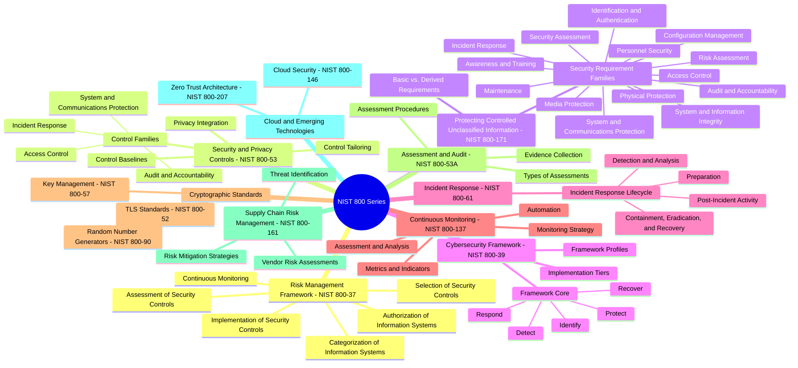

```mermaid
mindmap
  root((NIST 800 Series))
    Risk Management Framework - NIST 800-37
      Categorization of Information Systems
      Selection of Security Controls
      Implementation of Security Controls
      Assessment of Security Controls
      Authorization of Information Systems
      Continuous Monitoring
    Security and Privacy Controls - NIST 800-53
      Control Families
        Access Control
        Audit and Accountability
        Incident Response
        System and Communications Protection
      Control Baselines
      Control Tailoring
      Privacy Integration
    Protecting Controlled Unclassified Information - NIST 800-171
      Security Requirement Families
        Access Control
        Awareness and Training
        Audit and Accountability
        Configuration Management
        Identification and Authentication
        Incident Response
        Maintenance
        Media Protection
        Physical Protection
        Personnel Security
        Risk Assessment
        Security Assessment
        System and Communications Protection
        System and Information Integrity
      Basic vs. Derived Requirements
    Cybersecurity Framework - NIST 800-39
      Framework Core
        Identify
        Protect
        Detect
        Respond
        Recover
      Implementation Tiers
      Framework Profiles
    Incident Response - NIST 800-61
      Incident Response Lifecycle
        Preparation
        Detection and Analysis
        Containment, Eradication, and Recovery
        Post-Incident Activity
    Continuous Monitoring - NIST 800-137
      Monitoring Strategy
      Metrics and Indicators
      Automation
      Assessment and Analysis
    Cryptographic Standards
      Key Management - NIST 800-57
      TLS Standards - NIST 800-52
      Random Number Generators - NIST 800-90
    Assessment and Audit - NIST 800-53A
      Assessment Procedures
      Types of Assessments
      Evidence Collection
    Supply Chain Risk Management - NIST 800-161
      Threat Identification
      Risk Mitigation Strategies
      Vendor Risk Assessments
    Cloud and Emerging Technologies
      Cloud Security - NIST 800-146
      Zero Trust Architecture - NIST 800-207
```
