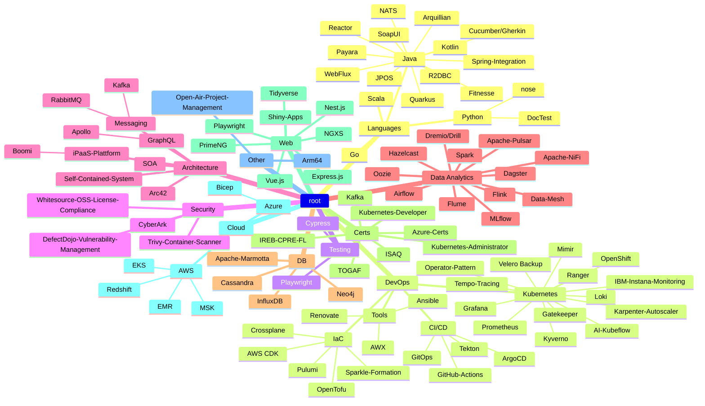

# Trends

```mermaid
mindmap
  root
    Languages
      Go
      Scala
      Java
        WebFlux
        Reactor
        R2DBC
        Payara
        Kotlin
        Arquillian
        SoapUI
        Fitnesse
        Cucumber/Gherkin
        Spring-Integration
        Quarkus
        NATS
        JPOS
      Python
        DocTest
        nose
    DevOps
      Kubernetes
        Kyverno
        Gatekeeper
        AI-Kubeflow
        Prometheus
        Mimir
        Grafana
        Loki
        Tempo-Tracing
        OpenShift
        Ranger
        IBM-Instana-Monitoring
        Operator-Pattern
        Karpenter-Autoscaler
        Velero Backup
      CI/CD
        Tekton
        GitOps
        GitHub-Actions
        ArgoCD
      Tools
        Ansible
        AWX
        Renovate
      IaC
        Crossplane
        OpenTofu
        Sparkle-Formation             
        Pulumi
        AWS CDK
    Testing
      Cypress
      Playwright
    Security
      Whitesource-OSS-License-Compliance
      Trivy-Container-Scanner
      DefectDojo-Vulnerability-Management
      CyberArk
    Architecture
      SOA
      GraphQL
        Apollo
      Arc42
      Self-Contained-System
      iPaaS-Plattform
        Boomi
      Messaging
        Kafka
        RabbitMQ
    Data Analytics
      Apache-NiFi
      Apache-Pulsar
      Dremio/Drill
      Hazelcast
      Flink   
      Spark
      Dagster
      Airflow
      Oozie
      Flume
      Data-Mesh
      MLflow 
    DB
      InfluxDB
      Neo4j
      Cassandra
      Apache-Marmotta     
    Certs
      Kubernetes-Administrator
      Kubernetes-Developer
      IREB-CPRE-FL
      TOGAF
      Azure-Certs
      Kafka
      ISAQ
    Web
      Vue.js
      Nest.js
      Express.js
      NGXS
      PrimeNG
      Shiny-Apps
      Tidyverse
      Playwright
    Cloud
      AWS
        MSK
        EMR
        Redshift
        EKS
      Azure
        Bicep
    Other
      Arm64
      Open-Air-Project-Management
```
