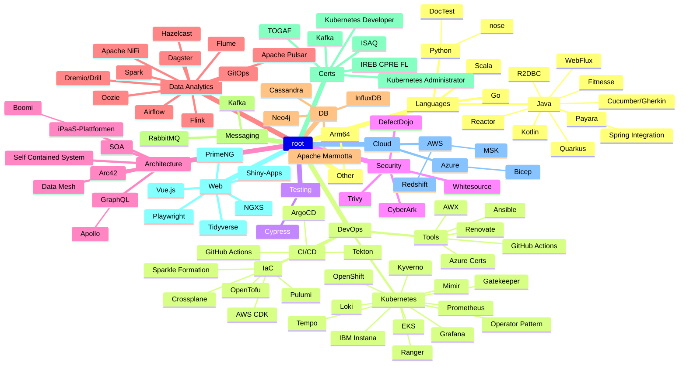

# Trends

```mermaid
mindmap
  root
    Languages
      Go
      Scala
      Java
        Kotlin
        WebFlux
        Reactor
        R2DBC
        Payara
        Spring Integration
        Fitnesse
        Cucumber/Gherkin
        Quarkus
      Python
        DocTest
        nose
    DevOps
      CI/CD
        Tekton
        GitHub Actions
        ArgoCD
      Kubernetes
        OpenShift
        EKS
        Kyverno
        Gatekeeper
        Prometheus
        Grafana
        Mimir
        Ranger        
        Operator Pattern
        Loki
        IBM Instana
        Tempo
      Tools
        Ansible
        AWX
        Renovate
        GitHub Actions
        Azure Certs
      IaC
        OpenTofu
        AWS CDK
        Crossplane
        Pulumi
        Sparkle Formation             
    Testing
      Cypress
    Security
      DefectDojo
      CyberArk
      Trivy
      Whitesource
    Architecture
      SOA
      Self Contained System
      Data Mesh
      Arc42
      GraphQL
        Apollo
      iPaaS-Plattformen
        Boomi
    Data Analytics
      Dremio/Drill
      Spark
      Dagster
      Airflow
      Oozie
      GitOps
      Flume
      Apache NiFi
      Apache Pulsar
      Hazelcast
      Flink   
    DB
      InfluxDB
      Neo4j
      Cassandra
      Apache Marmotta     
    Messaging
      RabbitMQ
      Kafka
    Certs
      Kubernetes Administrator
      Kubernetes Developer
      IREB CPRE FL
      Kafka
      ISAQ
      TOGAF
    Web
      Vue.js
      NGXS
      PrimeNG
      Shiny-Apps
      Tidyverse
      Playwright
    Cloud
      AWS
        MSK
        Redshift
      Azure
        Bicep
    Other
      Arm64
```
